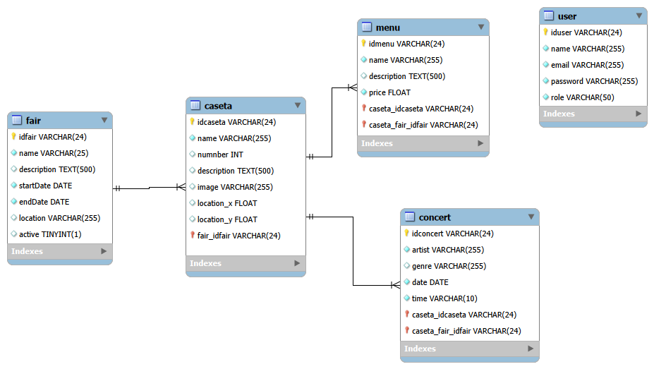

# 05. Design.

## Application architecture.

FeriaApp follows a hybrid architecture composed of two distinct systems:

**System 1 – Administration Panel (MERN):**
- **Frontend:** React SPA served from an Nginx container.
- **Backend:** REST API with Node.js and Express.
- **Database:** MongoDB.
- **Proxy:** Nginx as a reverse proxy routing requests between the frontend, backend and public website.

**System 2 – Static Public Website (GitHub Pages):**
- Static HTML, CSS and JavaScript served from GitHub Pages.
- Data is published in JSON format via Octokit when the administrator presses "Publish".
- Functions as a PWA with Service Workers for offline support.

```
Visitor
      │
      ▼
GitHub Pages (gh-pages branch)
├── index.html / app.js / styles.css
├── data/fairs.json
├── data/casetas.json
├── data/menus.json
├── data/concerts.json
└── uploads/ (images)

Administrator
      │
      ▼
Nginx (port 80)
├── / → React Frontend (admin panel)
├── /api/ → Express Backend (port 5000)
└── /public/ → Static public website
      │
      ▼
MongoDB (port 27017)
```

---

## Entity-Relationship diagram.



---

## API Endpoints.

### Authentication.

| Method | Endpoint | Access | Description |
|---|---|---|---|
| POST | /api/auth/login | Public | Log in |
| GET | /api/auth/profile | Private | Get admin profile |

### Fairs.

| Method | Endpoint | Access | Description |
|---|---|---|---|
| GET | /api/fairs | Public | Get all fairs |
| POST | /api/fairs | Private | Create a fair |
| PUT | /api/fairs/:id | Private | Update a fair |
| DELETE | /api/fairs/:id | Private | Delete a fair |

### Casetas.

| Method | Endpoint | Access | Description |
|---|---|---|---|
| GET | /api/casetas | Public | Get all stalls |
| POST | /api/casetas | Private | Create a stall |
| PUT | /api/casetas/:id | Private | Update a stall |
| DELETE | /api/casetas/:id | Private | Delete a stall |

### Menus.

| Method | Endpoint | Access | Description |
|---|---|---|---|
| GET | /api/menus | Public | Get all menu items |
| GET | /api/menus/caseta/:casetaId | Public | Get menu items for a stall |
| POST | /api/menus | Private | Create a dish |
| POST | /api/menus/bulk | Private | Create multiple dishes at once |
| PUT | /api/menus/:id | Private | Update a dish |
| DELETE | /api/menus/:id | Private | Delete a dish |

### Concerts.

| Method | Endpoint | Access | Description |
|---|---|---|---|
| GET | /api/concerts | Public | Get all concerts |
| POST | /api/concerts | Private | Create a concert |
| PUT | /api/concerts/:id | Private | Update a concert |
| DELETE | /api/concerts/:id | Private | Delete a concert |

### Publishing.

| Method | Endpoint | Access | Description |
|---|---|---|---|
| POST | /api/publish | Private | Generate and publish the public website on GitHub Pages |

---

## API Response format.

### Standard paginated response:

All `GET` collection endpoints return a paginated object instead of a plain array:

```json
{
  "total": 8,
  "page": 1,
  "pages": 1,
  "data": [
    { "_id": "...", "name": "...", ... }
  ]
}
```

| Field | Type | Description |
|---|---|---|
| total | Number | Total number of documents matching the filter |
| page | Current page number |
| pages | Number | Total number of pages |
| data | Array | Array of documents for the current page |

## API endpoints

### Fairs

| Method | Endpoint | Access | Description |
|---|---|---|---|
| GET | /api/fairs | Public | Get all fairs with pagination and filters |
| GET | /api/fairs/active | Public | Get only active fairs |
| GET | /api/fairs/latest | Public | Get most recent fair |
| GET | /api/fairs/range | Public | Get fairs by date range |
| GET | /api/fairs/count/status | Public | Count active vs inactive fairs |
| GET | /api/fairs/sorted/enddate | Public | Get fairs sorted by end date descending |
| GET | /api/fairs/search/:name | Public | Search fairs by name |
| GET | /api/fairs/:id | Public | Get a fair by ID |
| GET | /api/fairs/:id/casetas | Public | Get a fair with its stalls |
| GET | /api/fairs/:id/full | Public | Get a fair with stalls, menus and concerts |
| POST | /api/fairs | Private | Create a fair |
| PUT | /api/fairs/:id | Private | Update a fair |
| DELETE | /api/fairs/:id | Private | Delete a fair |

### Stalls

| Method | Endpoint | Access | Description |
|---|---|---|---|
| GET | /api/casetas | Public | Get all stalls with pagination and filters |
| GET | /api/casetas/sorted/desc | Public | Get stalls sorted by number descending |
| GET | /api/casetas/filter/withimage | Public | Get stalls with image |
| GET | /api/casetas/filter/noimage | Public | Get stalls without image |
| GET | /api/casetas/filter/highest | Public | Get stall with highest number |
| GET | /api/casetas/filter/withlocation | Public | Get stalls with location defined |
| GET | /api/casetas/count/byfair | Public | Count stalls per fair |
| GET | /api/casetas/search/:name | Public | Search stalls by name |
| GET | /api/casetas/:id | Public | Get a stall by ID |
| GET | /api/casetas/:id/full | Public | Get a stall with its menus and concerts |
| POST | /api/casetas | Private | Create a stall |
| PUT | /api/casetas/:id | Private | Update a stall |
| DELETE | /api/casetas/:id | Private | Delete a stall |

### Menus

| Method | Endpoint | Access | Description |
|---|---|---|---|
| GET | /api/menus | Public | Get all menus with pagination and filters |
| GET | /api/menus/sorted/price | Public | Get menus sorted by price ascending |
| GET | /api/menus/filter/price | Public | Get menus by price range `?min=5&max=15` |
| GET | /api/menus/filter/mostexpensive | Public | Get most expensive menu item |
| GET | /api/menus/filter/cheapest | Public | Get cheapest menu item |
| GET | /api/menus/filter/nodescription | Public | Get menus without description |
| GET | /api/menus/filter/full | Public | Get menus with full caseta and fair info |
| GET | /api/menus/count/bycaseta | Public | Count menus per stall |
| GET | /api/menus/search/:name | Public | Search menus by name |
| GET | /api/menus/caseta/:id | Public | Get menus by stall |
| GET | /api/menus/:id/caseta | Public | Get the caseta of a menu |
| GET | /api/menus/:id/similar | Public | Get menus with similar price |
| GET | /api/menus/:id/caseta/concerts | Public | Get concerts of the caseta of a menu |
| POST | /api/menus | Private | Create a menu item |
| POST | /api/menus/bulk | Private | Create multiple menu items at once |
| PUT | /api/menus/:id | Private | Update a menu item |
| DELETE | /api/menus/:id | Private | Delete a menu item |

### Concerts

| Method | Endpoint | Access | Description |
|---|---|---|---|
| GET | /api/concerts | Public | Get all concerts with pagination and filters |
| GET | /api/concerts/sorted/desc | Public | Get concerts sorted by date descending |
| GET | /api/concerts/filter/daterange | Public | Get concerts by date range |
| GET | /api/concerts/filter/upcoming | Public | Get upcoming concerts |
| GET | /api/concerts/filter/nogenre | Public | Get concerts without genre |
| GET | /api/concerts/filter/full | Public | Get concerts with full caseta and fair info |
| GET | /api/concerts/count/bycaseta | Public | Count concerts per stall |
| GET | /api/concerts/filter/genre/:genre | Public | Get concerts by genre |
| GET | /api/concerts/search/:artist | Public | Search concerts by artist |
| GET | /api/concerts/caseta/:id | Public | Get concerts by stall |
| GET | /api/concerts/:id/caseta | Public | Get the caseta of a concert |
| GET | /api/concerts/:id/sameday | Public | Get concerts on the same day |
| GET | /api/concerts/:id/samegenre | Public | Get concerts of the same genre |
| GET | /api/concerts/:id/caseta/menus | Public | Get menus of the caseta of a concert |
| POST | /api/concerts | Private | Create a concert |
| PUT | /api/concerts/:id | Private | Update a concert |
| DELETE | /api/concerts/:id | Private | Delete a concert |

### Statistics

| Method | Endpoint | Access | Description |
|---|---|---|---|
| GET | /api/stats | Public | Get general statistics and complex aggregations |

### Complex queries implemented in /api/stats

| Query | Description |
|---|---|
| menusByCaseta | Total menus, average, min and max price per stall |
| concertsByCaseta | Total concerts per stall |
| concertsByDate | Total concerts per date |
| casetasByFair | Total stalls per fair |
| topArtists | Most repeated artists |
| casetasWithoutConcerts | Stalls with no concerts |
| activeFairs | Currently active fairs |
| casetasByFairAndNumber | Stalls filtered by fair and number range |
| menusByPriceRange | Menus filtered by price range with lookup |
| concertsByDateRange | Concerts filtered by date range with lookup |
| casetasComplete | Stalls with their menus and concerts in one query |
| fairsComplete | Fairs with their stalls in one query |

---

## Use case diagram.

**Administrator:**
- Log into the panel.
- Manage fairs (CRUD).
- Manage stalls (CRUD + map location).
- Manage menus (individual and bulk CRUD).
- Manage concerts (CRUD).
- Publish the public website.

**Visitor:**
- View general fair information.
- See the interactive map with stalls.
- Search for stalls by name.
- View stall detail (menu + schedule).
- Download the full menu as PDF.
- Install the app as a PWA.
- Use the app offline.

---

## Flow diagrams.

### Public website publishing flow.

```
Admin presses "Publish"
        │
        ▼
Backend queries MongoDB
(fairs, stalls, menus, concerts)
        │
        ▼
Generates JSON files
        │
        ▼
Octokit uploads JSON to gh-pages branch
        │
        ▼
Octokit uploads images to gh-pages/uploads/
        │
        ▼
GitHub Pages deploys automatically
        │
        ▼
Public website updated ✓
```

### Authentication flow.

```
Admin enters email and password
        │
        ▼
Backend verifies credentials with bcrypt
        │
    ┌───┴───┐
    │       │
  Error   Success
    │       │
    ▼       ▼
  401    Generates JWT
          │
          ▼
  Frontend stores token
  in sessionStorage
          │
          ▼
  Access to panel
```