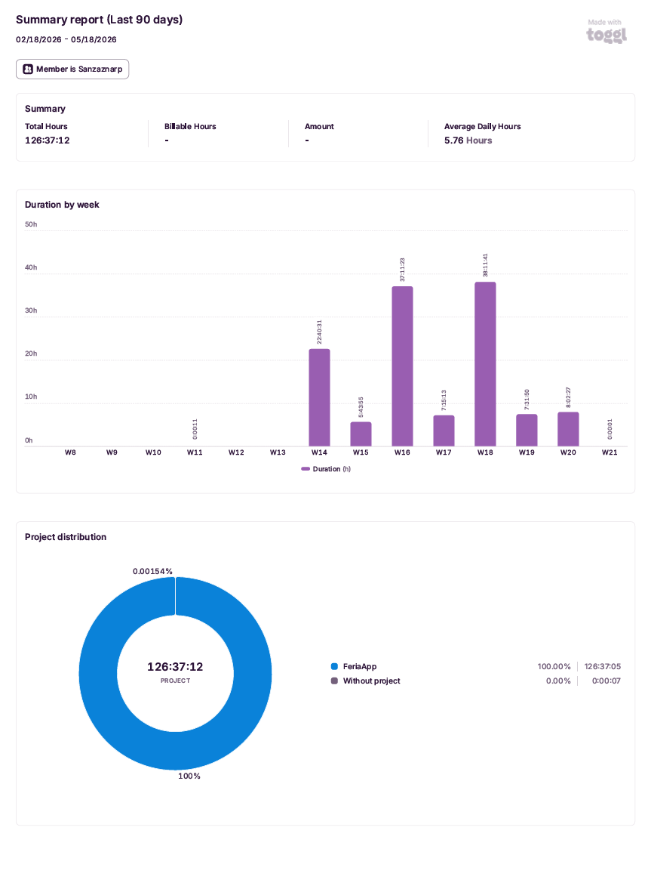

# 06. Development.

## Development sequence:

Development was organised into 5 sprints following an agile methodology with GitHub Projects as the Kanban board.

### Sprint 1 – Initial setup.
- Repository creation on GitHub with the `main`, `develop` and `gh-pages` branches.
- GitHub Projects board configuration.
- Figma prototyping of the main screens.
- Technical architecture design.

### Sprint 2 – Backend.
- Implementation of data models: Fair, Caseta, Menu, Concert, User.
- REST API development with Express and JWT authentication.
- Swagger configuration for automatic API documentation.
- Manual testing of all endpoints with Insomnia.
- `seedAdmin.js` script to create the initial administrator user.

### Sprint 3 – Administration panel.
- Administration panel development with React and Vite.
- Login system implementation with JWT and protected routes.
- CRUD forms for fairs, stalls, menus and concerts.
- Leaflet.js integration for the stall location editor on the official plan.
- AI-powered stall detection: upload a fair map and have Claude (Anthropic) detect each stall, read its number, and propose a position, with a review map for manual fine-tuning before a bulk import.
- Per-fair maps: each fair stores its own map and bounds, travelling together with the stall coordinates.
- Role-based access control with three panel roles (admin, editor, viewer) and a Users section to manage them.
- Image uploads with Multer.
- "Publish" button implementation with Octokit to generate and publish the public website.

### Sprint 4 – Public website.
- Static public website development as a PWA.
- Leaflet.js integration for the interactive stall map.
- Smart search implementation with Fuse.js and typo tolerance.
- Service Worker and manifest.json configuration for offline support and installation.
- Menu PDF generation with jsPDF.
- Deployment on GitHub Pages from the `gh-pages` branch.

### Sprint 5 – Deployment and testing.
- Dockerfile creation for backend, frontend and public website.
- Nginx configuration as a reverse proxy.
- Orchestration with docker-compose.
- CI/CD pipeline with GitHub Actions.
- Unit tests with Jest and Supertest.
- Complete documentation in `/docs`.

---

## Key technical decisions.

### AI vision for stall detection (Claude / Anthropic):

The core differentiating feature of the project is automatic stall detection from a fair map. The first implementation used a computer-vision pipeline (OpenCV + OCR in Python) calibrated specifically for the Jerez plan: it was accurate there but rigid, and could not adapt to a different map. It was therefore replaced by an AI vision model (Claude `claude-opus-4-8`, via the official `@anthropic-ai/sdk`), which interprets any map visually and returns each stall with its number, an approximate relative position, and — when the map has a side legend pairing numbers with names — the stall's **name**.

To stay independent of any image-processing library for detection, the model returns **relative** coordinates (a fraction of the map's width and height); the backend reads the image's real dimensions directly from the PNG/JPEG file header and scales those fractions to the project's Leaflet coordinate convention. Because AI positions are approximate, the panel shows the detected stalls on a review map where the administrator drags each marker to its exact spot and edits, adds or removes stalls before importing. The administrator can also **crop** the published map by dragging a rectangle; the backend then crops the image with `sharp` and re-maps each stall's position to the cropped region (a coordinate transform that is unit-tested in `cropMap.test.js`). Automatic detection does the bulk of the work; a final human adjustment guarantees precision. The API key lives only in a server-side environment variable and is never committed to the repository.

### Lazy loading of panel pages (code splitting):

The administration panel uses route-based **code splitting**: every page (`Dashboard`, `Fairs`, `Casetas`, `Menus`, `Concerts`, `Users`, `Login`, `Register`) is loaded with `React.lazy()` and rendered inside a `<Suspense>` boundary with a loading fallback. Vite emits a separate JavaScript chunk per page, so the browser only downloads the code for the page the user actually visits instead of the whole panel up front. This noticeably reduces the initial bundle — the heaviest page (`Casetas`, which bundles the Leaflet map) is no longer part of the first load and is fetched on demand only when its route is opened.

### Accessibility of dialogs:

All modal dialogs (delete confirmations, publish, map import) are marked up as accessible dialogs: `role="dialog"`, `aria-modal="true"` and `aria-labelledby` pointing at the dialog title, plus an `aria-label` on the close button. A small reusable hook (`useModalClose`) closes the open dialog with the **Escape** key, so dialogs are fully operable from the keyboard and announced correctly by screen readers.

### Hybrid architecture (MERN + GitHub Pages):

A hybrid architecture was chosen instead of a traditional server to serve the public website. The main reason is that fair visitors need a website that loads quickly and works offline, something that can only be achieved with a static page. GitHub Pages allows hosting that website for free with very good availability.

### Octokit for automatic publishing:

Instead of a manual deployment process, Octokit was implemented so the administrator can publish the public website with a single click from the panel. This removes the need for the administrator to have technical knowledge of Git or deployment.

### Fuse.js for typo-tolerant search:

Fuse.js was chosen because it provides fuzzy search without the need for an external search server. This allows visitors to find stalls even if they misspell the name, which is especially useful in a festive environment where attention to detail decreases.

### jsPDF for client-side PDF generation:

PDF generation happens in the visitor's browser, without requiring a server. This reduces backend load and allows the PDF to be generated even without a connection if the app is installed as a PWA.

### JWT stored in sessionStorage:

SessionStorage was chosen over localStorage to store the JWT token. This means the session closes automatically when the browser is closed, which is more secure for an administration panel.

---

## Difficulties encountered and how they were overcome.

### Problem: The .env file was accidentally committed to the gh-pages branch.

When copying public website files to the `gh-pages` branch, the backend `.env` file was included in the commit. GitHub detected it and blocked the push with its Push Protection system.

**Solution:** `Remove-Item C:\FeriaApp\backend\.env` was added before each commit on `gh-pages`, and `git filter-branch` was used to clean the history when the token had already been included. Long-term, this will be automated with GitHub Actions.

### Problem: @octokit/rest v22 uses ES Modules and Jest uses CommonJS.

When running tests with Jest, they failed because `@octokit/rest` v22 only supports ES Modules and cannot be loaded with `require()`.

**Solution:** An Octokit mock was added to the tests using `jest.mock()` so that Jest does not attempt to load the real module.

### Problem: The frontend in Docker made requests to localhost:5000 instead of /api/.

In local development, the frontend pointed directly to the backend at `http://localhost:5000/api`. This did not work in Docker because containers do not share `localhost`.

**Solution:** The axios client configuration was modified to use `import.meta.env.VITE_API_URL || '/api'`, so that in development it uses the environment variable and in Docker it uses the relative path that Nginx redirects to the backend.

### Problem: React routes returned 404 in Nginx.

When accessing a route like `/login` directly, Nginx returned 404 because it looked for a physical file instead of serving `index.html`.

**Solution:** A custom `nginx.conf` was added to the frontend container with `try_files $uri $uri/ /index.html` so that all routes return `index.html` and React Router handles them on the client side.

---

## Version control tools.

- **Git** with the `main`, `develop` and `gh-pages` branches.
- **GitHub Projects** as the Kanban board for task management.
- **GitHub Actions** for the automated CI/CD pipeline.
- Workflow: development on `develop` → merge to `main` at the end of each sprint.

---

## Time tracking with Toggl Track.

Throughout the project, **Toggl Track** was used to measure the actual time invested in each sprint, in coding sessions and in the writing of the documentation itself. Each work block (backend, admin panel, public site, deployment, testing and `/docs` writing) was started and stopped on the Toggl timer under the `FeriaApp` project, which produced a per-week breakdown of effort across the whole development cycle.

This time-tracking exercise served two purposes:

- **Self-management**: it made it visible when a sprint was running over its expected budget, allowing scope to be adjusted before the next sprint started.
- **Evidence for the documentation**: the writing of the `/docs` files (this very document among them) was also tracked, so the effort behind the documentation is not just a claim — it is recorded as billable hours in the report.

The summary report exported from Toggl is committed to the repository and covers the full development window (02/18/2026 – 05/18/2026):



- **Total hours tracked**: 126:37:12
- **Average daily hours**: 5.76 h
- **Project distribution**: 100% allocated to `FeriaApp` (with a negligible 0.00154% logged without project).
- **Per-week breakdown**: effort concentrates in weeks W14–W20, with the largest peaks in **W16 (37:11:23)** and **W18 (38:11:41)** — these correspond to the backend and administration panel sprints, which were the most code-intensive phases of the project. Weeks W19–W20 reflect the documentation-writing effort itself.

The full report is also available as a downloadable PDF for reference:

- [Toggl Track summary report (PDF)](toggl/toggl-report-summary.pdf)

---

## Relevant code snippets.

### Publishing with Octokit:

```javascript
const uploadFile = async (path, content, message) => {
  const contentBase64 = Buffer.from(content).toString('base64');
  try {
    const { data } = await octokit.rest.repos.getContent({
      owner: process.env.GITHUB_OWNER,
      repo: process.env.GITHUB_REPO,
      path,
      ref: 'gh-pages',
    });
    await octokit.rest.repos.createOrUpdateFileContents({
      owner: process.env.GITHUB_OWNER,
      repo: process.env.GITHUB_REPO,
      path,
      message,
      content: contentBase64,
      sha: data.sha,
      branch: 'gh-pages',
    });
  } catch {
    await octokit.rest.repos.createOrUpdateFileContents({
      owner: process.env.GITHUB_OWNER,
      repo: process.env.GITHUB_REPO,
      path,
      message,
      content: contentBase64,
      branch: 'gh-pages',
    });
  }
};
```

### PDF Generation with jsPDF.

```javascript
const downloadMenuPDF = (id) => {
  const caseta = casetas.find((c) => c._id === id);
  const casetaMenus = menus.filter((m) => m.caseta?._id === id || m.caseta === id);
  const { jsPDF } = window.jspdf;
  const doc = new jsPDF();
  doc.setFontSize(20);
  doc.text(`Menu - ${caseta.name}`, 20, 20);
  let y = 45;
  casetaMenus.forEach((m) => {
    doc.text(m.name, 20, y);
    doc.text(`${m.price}€`, 170, y, { align: 'right' });
    y += 10;
  });
  doc.save(`menu-${caseta.name.toLowerCase().replace(/\s+/g, '-')}.pdf`);
};
```

---

## Pagination, filtering and sorting:

In Sprint 5, pagination, filtering and sorting support was added to all main GET endpoints. This improvement allows clients to request specific subsets of data rather than retrieving all documents at once.

### Implementation:

Each controller was updated to support the following pattern:

```javascript
const filter = {};
if (req.query.fair) filter.fair = req.query.fair;

const page = parseInt(req.query.page) || 1;
const limit = parseInt(req.query.limit) || 100;
const skip = (page - 1) * limit;

const total = await Model.countDocuments(filter);
const data = await Model.find(filter)
  .skip(skip)
  .limit(limit)
  .sort({ field: 1 });

res.json({ total, page, pages: Math.ceil(total / limit), data });
```

### Decisions made:

- Default `limit` is set to 100 to maintain backwards compatibility with the frontend while still supporting explicit pagination.
- Each endpoint has its own sorting criteria based on the most logical field for that entity.
- Filters are optional — if no query parameters are provided, all documents are returned.

### Frontend adaptation:

All frontend services and pages were updated to handle the new paginated response format, accessing `response.data` instead of the raw array.

### Test adaptation:

All 208 unit tests were updated to use `res.body.data` instead of `res.body` when asserting on collection responses.

---

## New endpoints and complex queries

In Sprint 4, 32 new endpoints were added to the API covering advanced queries, filters, sorting and aggregations across all modules.

### New endpoints per module

**Fairs (8 new endpoints):**
- `GET /api/fairs/active` — active fairs only
- `GET /api/fairs/latest` — most recent fair
- `GET /api/fairs/range` — fairs by date range
- `GET /api/fairs/count/status` — count active vs inactive
- `GET /api/fairs/sorted/enddate` — sorted by end date descending
- `GET /api/fairs/search/:name` — search by name using regex
- `GET /api/fairs/:id/casetas` — fair with its stalls
- `GET /api/fairs/:id/full` — fair with stalls, menus and concerts

**Stalls (8 new endpoints):**
- `GET /api/casetas/sorted/desc` — sorted by number descending
- `GET /api/casetas/filter/withimage` — stalls with image
- `GET /api/casetas/filter/noimage` — stalls without image
- `GET /api/casetas/filter/highest` — stall with highest number
- `GET /api/casetas/filter/withlocation` — stalls with location
- `GET /api/casetas/count/byfair` — count per fair using aggregate
- `GET /api/casetas/search/:name` — search by name using regex
- `GET /api/casetas/:id/full` — stall with its menus and concerts

**Menus (8 new endpoints):**
- `GET /api/menus/sorted/price` — sorted by price ascending
- `GET /api/menus/filter/price` — by price range
- `GET /api/menus/filter/mostexpensive` — most expensive item
- `GET /api/menus/filter/cheapest` — cheapest item
- `GET /api/menus/filter/nodescription` — without description
- `GET /api/menus/filter/full` — with caseta and fair info via lookup
- `GET /api/menus/count/bycaseta` — count per stall using aggregate
- `GET /api/menus/search/:name` — search by name using regex

**Concerts (8 new endpoints):**
- `GET /api/concerts/sorted/desc` — sorted by date descending
- `GET /api/concerts/filter/daterange` — by date range
- `GET /api/concerts/filter/upcoming` — upcoming concerts
- `GET /api/concerts/filter/nogenre` — without genre
- `GET /api/concerts/filter/full` — with caseta and fair info via lookup
- `GET /api/concerts/count/bycaseta` — count per stall using aggregate
- `GET /api/concerts/filter/genre/:genre` — by genre using regex
- `GET /api/concerts/search/:artist` — search by artist using regex

### Statistics endpoint

A dedicated `GET /api/stats` endpoint was created using MongoDB aggregation pipelines with `$group`, `$lookup`, `$project`, `$match` and `$sort` stages to generate complex statistics across all collections.

### Total complex queries

| Module | Queries |
|---|---|
| fairController | 10 |
| casetaController | 10 |
| menuController | 11 |
| concertController | 11 |
| statsController | 13 |
| **Total** | **55** |

---

## Nested routes for menus and concerts

In addition to the nested routes under `/api/fairs/:id` and `/api/casetas/:id`, nested routes were also added for menus and concerts to allow navigation between related resources.

**Menus nested routes:**
- `GET /api/menus/:id/caseta` — get the stall of a specific menu item
- `GET /api/menus/:id/similar` — get menu items with a similar price (±2€)
- `GET /api/menus/:id/caseta/concerts` — get the concerts of the stall that serves this menu item

**Concerts nested routes:**
- `GET /api/concerts/:id/caseta` — get the stall of a specific concert
- `GET /api/concerts/:id/sameday` — get other concerts happening on the same day
- `GET /api/concerts/:id/samegenre` — get other concerts of the same genre
- `GET /api/concerts/:id/caseta/menus` — get the menu items of the stall where a concert takes place

### Total nested routes summary

| Route file | Nested routes |
|---|---|
| fairRoutes.js | 8 |
| casetaRoutes.js | 12 |
| menuRoutes.js | 3 |
| concertRoutes.js | 4 |
| **Total** | **27** |

---

## Role-based authorization

The original implementation used JWT only with a single `admin` user. To meet the rubric requirement of "authentication and authorization with roles", the system was extended with three roles (`admin`, `editor`, `viewer`) and a dedicated `authorize` middleware.

### Decisions made

- **Role enum on the `User` model** (`enum: ['admin', 'editor', 'viewer']`) instead of a free-form string — this keeps the set of valid roles closed and Mongoose rejects anything outside it.
- **Role loaded from the database on every request, not from the JWT payload.** The JWT only carries the user id; `protect` reads the user (with their current role) from MongoDB. Effect: if an admin is demoted to `viewer`, the next request fails with 403 immediately, without waiting for the token to expire.
- **`authorize(...roles)` is a separate middleware**, applied *after* `protect`. This separation keeps "is the request authenticated?" and "does this user have permission?" as two independent checks, each with its own status code (401 vs 403) and error code (`UNAUTHORIZED` vs `FORBIDDEN`).
- **All write routes (`POST`, `PUT`, `DELETE`) require `admin`.** GET routes are open to all authenticated users (or public). This matches the actual product: only the administrator publishes data; editor/viewer roles exist as a demonstration of the access control layer.
- **`seedAdmin.js` creates the three roles** in a single idempotent run (using `upsert`), so the demo accounts can be recreated without producing duplicates.

### Implementation

```javascript
// backend/src/middlewares/auth.js
const protect = async (req, res, next) => {
  // ...verify JWT, load user from DB into req.user...
};

const authorize = (...roles) => {
  return (req, res, next) => {
    if (!req.user) {
      return res.status(401).json({ error: 'Not authorized', code: 'UNAUTHORIZED' });
    }
    if (!roles.includes(req.user.role)) {
      return res.status(403).json({
        error: `Role '${req.user.role}' is not authorized to access this route`,
        code: 'FORBIDDEN'
      });
    }
    next();
  };
};

module.exports = { protect, authorize };
```

Routes apply both middlewares in order:

```javascript
// backend/src/routes/fairRoutes.js
router.post('/', protect, authorize('admin'), createFair);
router.put('/:id', protect, authorize('admin'), updateFair);
router.delete('/:id', protect, authorize('admin'), deleteFair);
```

### Verification

A dedicated test file `backend/tests/roles.test.js` exercises the authorization layer end to end: it logs in as `editor` and `viewer`, hits every write endpoint and asserts `403 / code: FORBIDDEN`. It also confirms that GET routes remain accessible to non-admin authenticated users. See [docs/07-pruebas.md](07-pruebas.md) for the full test breakdown.

---

## OpenAPI specification export

The API is documented in three formats: an interactive Swagger UI served at `/api/docs` (runtime), an exported OpenAPI 3.0 JSON file committed at `docs/api/openapi.json` (offline), and curl examples in `docs/08-despliegue.md`.

### Decisions made

- **Single source of truth**: the spec is generated from JSDoc comments in `src/routes/*.js` via `swagger-jsdoc`. Both Swagger UI (runtime) and the exported JSON consume the *same* in-memory spec, so they never drift.
- **Commit the artefact**: instead of relying on the backend running to inspect the API, a build step exports the spec to disk. The tribunal (or any reviewer) can import `docs/api/openapi.json` directly into Postman/Insomnia/Stoplight without cloning, installing dependencies or starting Mongo.
- **No new dependency**: the export reuses `swagger-jsdoc` (already installed for Swagger UI) — the script is 14 lines of plain Node.

### Implementation

```javascript
// backend/export-openapi.js
const fs = require('fs');
const path = require('path');
const swaggerSpec = require('./src/config/swagger');

const outDir = path.join(__dirname, '..', 'docs', 'api');
const outFile = path.join(outDir, 'openapi.json');

if (!fs.existsSync(outDir)) {
  fs.mkdirSync(outDir, { recursive: true });
}

fs.writeFileSync(outFile, JSON.stringify(swaggerSpec, null, 2), 'utf8');
console.log(`OpenAPI spec written to ${outFile}`);
```

It is exposed as an npm script in `backend/package.json`:

```json
"scripts": {
  "export:openapi": "node export-openapi.js"
}
```

Run it with:

```bash
cd backend
npm run export:openapi
```

---

## Client-side development (DWEC) — feature traceability.

This section maps the client-side rubric criteria to where each is implemented in the React admin panel (`frontend/src/`), so the evaluation can be traced directly to the code.

### 1. Modern language syntax and user-defined structures.

The panel is written entirely in modern ES6+: ES modules (`import`/`export`), arrow functions, destructuring, the spread operator, template literals, optional chaining (`?.`) and `async`/`await`. Beyond the built-in features, the project defines its own reusable structures:

- **Custom hooks:** `hooks/useModalClose.js` (close dialogs with Escape), `context/useAuth.js`, `context/useTheme.js`, `context/useToast.js`.
- **Reusable components:** `PrivateRoute`, `Sidebar`, `MapPicker`, `MapReview`, `ImportCasetasModal`, `RoleBanner`.
- **Utility modules:** `utils/permissions.js` (role checks), `utils/format.js` (price/date formatters).

The code is commented throughout: each file has a header explaining its purpose and non-obvious logic is annotated inline.

### 2. Built-in (predefined) objects of the language.

The application uses the language's predefined objects to process data and produce output:

- `Intl.NumberFormat` / `Intl.DateTimeFormat` — format prices as euros and dates in Spanish (`utils/format.js`).
- `Array` methods — `map`, `filter`, `sort`, `slice`, `reduce` (e.g. average menu price), `some`, `find`.
- `Set` — de-duplicate and track selected stalls during map import (`ImportCasetasModal.jsx`).
- `JSON.parse`/`JSON.stringify` and `sessionStorage`/`localStorage` — persist the session and theme.
- `Promise.all` — load dashboard counts in parallel.
- `RegExp` — client-side email/time validation.
- `FormData` — multipart uploads (images, map detection).

The document itself is updated as a result of execution: lists are rendered dynamically from fetched data, and the light/dark theme changes the document appearance via `document.documentElement.setAttribute('data-theme', …)`.

### 3. Event handling and form validation.

Interaction is event-driven: `onSubmit` (with `e.preventDefault()`), `onChange`, `onClick`, drag events on map markers (`dragend`), map click capture (`useMapEvents`) and a global `keydown` listener for the Escape key. Every form runs its own JavaScript validation function before submitting (with `noValidate` to disable the browser's native validation), producing field-level error messages — see `validate()` in `Login`, `Register`, `Fairs`, `Casetas`, `Menus`, `Concerts`.

### 4. Document Object Model (DOM).

The app accesses and modifies the document and associates actions to model events: `document.querySelector(...).scrollTo(...)` (scroll to the edit form), `document.documentElement.setAttribute` (theme), `document.body.style` (lock scroll when the mobile menu is open), `document.addEventListener`/`removeEventListener` (Escape handler, cleaned up on unmount), `useRef` for stable references, and dynamic conditional rendering that creates and removes elements from data.

### 5. Asynchronous client–server communication.

All communication is asynchronous through the **axios** library (`services/api.js`), with a request interceptor that attaches the JWT automatically. Calls use `async`/`await` with `try`/`catch` error handling, and two data formats are used: **JSON** for CRUD operations and **multipart/FormData** for file uploads (stall images and the fair map sent to AI detection). The document is updated dynamically after each response by re-rendering React state.

### Performance and accessibility.

The panel applies **route-based code splitting** (`React.lazy` + `Suspense` in `App.jsx`), so each page is a separate chunk downloaded on demand. Modal dialogs are accessible: `role="dialog"`, `aria-modal`, `aria-labelledby`, labelled close buttons and Escape-to-close keyboard support.

The current export is **~1.9k lines** covering every endpoint with its parameters, request bodies and response schemas.