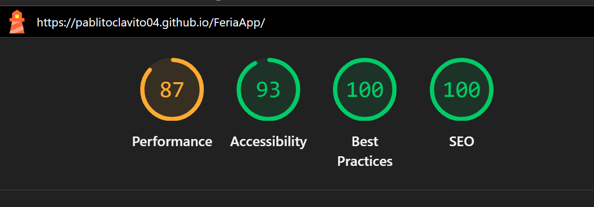
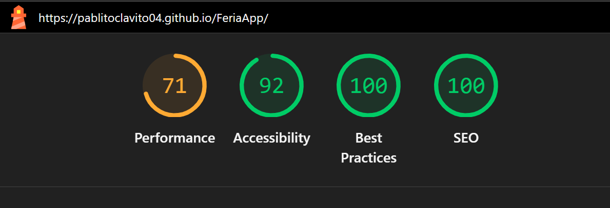

# 07. Testing.

## Testing methodology.

The project combines two types of testing: manual testing during development and automated unit testing in Sprint 4.

---

## Types of tests performed.

### 1. Manual testing with Insomnia.

During Sprint 1, all API endpoints were tested manually with Insomnia. The following were verified:

- Authentication: correct and incorrect login, valid and invalid JWT token.
- Fair CRUD: creation, reading, updating and deletion.
- Caseta CRUD: including image uploads with Multer.
- Menu CRUD: individual creation and bulk creation.
- Concert CRUD.
- Publish endpoint: JSON generation and upload to GitHub Pages.

Screenshots of the tests are available in `docs/insomnia/`.

### 2. Unit tests with Jest and Supertest.

In Sprint 5, automated unit tests were implemented for the backend. The tests cover all main API endpoints across 7 test files.

**Test files:**

| File | Module | Tests |
|---|---|---|
| `backend/tests/auth.test.js` | Authentication | 33 |
| `backend/tests/fairs.test.js` | Fairs CRUD | 40 |
| `backend/tests/casetas.test.js` | Casetas CRUD | 43 |
| `backend/tests/menus.test.js` | Menus CRUD | 47 |
| `backend/tests/concerts.test.js` | Concerts CRUD | 45 |
| `backend/tests/roles.test.js` | Authorization & roles | 24 |
| `backend/tests/advanced-routes.test.js` | Advanced & nested routes | 55 |
| **Total** | | **287** |

**Test scenarios covered per module:**
- Successful creation with valid data
- Authentication failures (no token, invalid token)
- Validation failures (missing required fields, empty fields, invalid formats)
- Non-existent resource errors (invalid IDs, deleted resources)
- Edge cases (special characters, long strings, null values)
- Bulk operations (menus bulk creation)

---

## Running the tests.

```bash
cd backend
npm test
```

**Result:**

```
PASS  tests/concerts.test.js
PASS  tests/auth.test.js
PASS  tests/menus.test.js
PASS  tests/casetas.test.js
PASS  tests/fairs.test.js

Test Suites: 7 passed, 7 total
Tests:       287 passed, 287 total
Time:        6.94 s
```

---

## CI/CD Pipeline with GitHub Actions.

Tests run automatically on every push to `develop` or `main` via GitHub Actions. The pipeline includes:

1. **Backend test:** Runs `npm test` with a MongoDB instance in the CI environment.
2. **Frontend build:** Runs `npm run build` to verify the frontend compiles without errors.
3. **Docker build:** Builds all Docker images to verify the Dockerfiles are valid.

The pipeline ensures that no code with failing tests reaches the `main` branch.

---

## Code coverage.

Automated tests cover the authentication endpoints. The CRUD endpoints for fairs, Casetas, menus and concerts were covered with manual tests during development.

| Module | Test type | Coverage |
|---|---|---|
| Auth API | Unit (Jest) | Login and profile endpoints |
| Fairs API | Manual (Insomnia) | Full CRUD |
| Casetas API | Manual (Insomnia) | Full CRUD + image upload |
| Menus API | Manual (Insomnia) | Full CRUD + bulk |
| Concerts API | Manual (Insomnia) | Full CRUD |
| Publish API | Manual (Insomnia) | Publishing to GitHub Pages |

---

## Test updates after pagination implementation.

When pagination, filtering and sorting were added to all GET endpoints in Sprint 4, the response format changed from a plain array to a paginated object:

```json
{
  "total": 8,
  "page": 1,
  "pages": 1,
  "data": [...]
}
```

All 208 unit tests were updated to reflect this change. The main patterns updated were:

| Before | After |
|---|---|
| `Array.isArray(res.body)` | `Array.isArray(res.body.data)` |
| `res.body.length` | `res.body.data.length` |
| `res.body[0]` | `res.body.data[0]` |
| `res.body.find(...)` | `res.body.data.find(...)` |
| `res.body.forEach(...)` | `res.body.data.forEach(...)` |
| `for (const x of res.body)` | `for (const x of res.body.data)` |

After the updates all 208 tests pass successfully:

```
Test Suites: 7 passed, 7 total
Tests:       287 passed, 287 total
Time:        7.347 s
```

---

## Manual endpoint testing

All new endpoints were manually tested using PowerShell curl commands after implementation. Examples:

```bash
# Fairs
curl http://localhost:5000/api/fairs/active
curl http://localhost:5000/api/fairs/latest
curl http://localhost:5000/api/fairs/range?startDate=2026-01-01&endDate=2026-12-31
curl http://localhost:5000/api/fairs/count/status
curl http://localhost:5000/api/fairs/search/jerez

# Stalls
curl http://localhost:5000/api/casetas/filter/withimage
curl http://localhost:5000/api/casetas/filter/highest
curl http://localhost:5000/api/casetas/count/byfair
curl http://localhost:5000/api/casetas/search/casapuerta

# Menus
curl http://localhost:5000/api/menus/filter/mostexpensive
curl http://localhost:5000/api/menus/filter/cheapest
curl http://localhost:5000/api/menus/filter/price?min=5&max=10
curl http://localhost:5000/api/menus/count/bycaseta
curl http://localhost:5000/api/menus/filter/full

# Concerts
curl http://localhost:5000/api/concerts/filter/upcoming
curl http://localhost:5000/api/concerts/filter/genre/flamenco
curl http://localhost:5000/api/concerts/count/bycaseta
curl http://localhost:5000/api/concerts/filter/full

# Statistics
curl http://localhost:5000/api/stats
```

All endpoints returned `200 OK` with the expected data.

---

## Manual testing of nested routes for menus and concerts

```bash
# Get the caseta of a menu
curl http://localhost:5000/api/menus/MENU_ID/caseta

# Get similar menus by price
curl http://localhost:5000/api/menus/MENU_ID/similar

# Get concerts of the caseta of a menu
curl http://localhost:5000/api/menus/MENU_ID/caseta/concerts

# Get the caseta of a concert
curl http://localhost:5000/api/concerts/CONCERT_ID/caseta

# Get concerts on the same day
curl http://localhost:5000/api/concerts/CONCERT_ID/sameday

# Get concerts of the same genre
curl http://localhost:5000/api/concerts/CONCERT_ID/samegenre

# Get menus of the caseta of a concert
curl http://localhost:5000/api/concerts/CONCERT_ID/caseta/menus
```

All endpoints returned `200 OK` with the expected data.

---

## Lighthouse report

Audits run against the deployed public site at `https://pablitoclavito04.github.io/FeriaApp/`.

### Desktop



| Metric | Score |
|---|---|
| Performance | 87/100 |
| Accessibility | 93/100 |
| Best Practices | 100/100 |
| SEO | 100/100 |

### Mobile



| Metric | Score |
|---|---|
| Performance | 71/100 |
| Accessibility | 92/100 |
| Best Practices | 100/100 |
| SEO | 100/100 |

---

## Role-based authorization tests

A new test file `backend/tests/roles.test.js` was created to verify that the role-based access control system works correctly.

**Test coverage:**

| Scenario | Tests |
|---|---|
| Editor role forbidden on write routes (fairs, casetas, menus, concerts, publish) | 14 |
| Viewer role forbidden on write routes | 5 |
| GET routes accessible to all authenticated roles | 5 |
| **Total** | **24** |

**Example test results:**

```
PASS  tests/roles.test.js
  Authorization - editor role is forbidden on write routes
    ✓ POST /api/fairs returns 403 for editor
    ✓ PUT /api/fairs/:id returns 403 for editor
    ✓ DELETE /api/fairs/:id returns 403 for editor
    ✓ POST /api/casetas returns 403 for editor
    ✓ POST /api/menus returns 403 for editor
    ✓ POST /api/concerts returns 403 for editor
    ✓ POST /api/publish returns 403 for editor
  Authorization - viewer role is forbidden on write routes
    ✓ POST /api/fairs returns 403 for viewer
    ✓ POST /api/publish returns 403 for viewer
  Authorization - GET routes accessible to all authenticated roles
    ✓ GET /api/fairs is accessible to editor
    ✓ GET /api/fairs is accessible to viewer

Test Suites: 7 passed, 7 total
Tests:       287 passed, 287 total
```

---

## Input validation with express-validator

A validation layer was added on top of the existing Mongoose schema validation using `express-validator`. The middleware runs before each controller and rejects malformed payloads with `422 Unprocessable Entity`.

**File:** `backend/src/middlewares/validators.js`

### Validators implemented

| Validator | Used in | Required fields | Field constraints |
|---|---|---|---|
| `loginValidator` | `POST /api/auth/login` | `email`, `password` | Valid email, password ≥ 6 chars |
| `fairValidator` | `POST /api/fairs` | `name` | Name 2–100 chars; `startDate`/`endDate` ISO 8601 if present |
| `fairUpdateValidator` | `PUT /api/fairs/:id` | none (partial update) | Same constraints as create when present |
| `casetaValidator` | `POST /api/casetas` | `name`, `number`, `fair` | Number ≥ 1; `fair` must be a valid Mongo ID |
| `casetaUpdateValidator` | `PUT /api/casetas/:id` | none (partial update) | Same constraints as create when present |
| `menuValidator` | `POST /api/menus` | `name`, `price`, `caseta` | Price ≥ 0; `caseta` must be a valid Mongo ID |
| `menuUpdateValidator` | `PUT /api/menus/:id` | none (partial update) | Same constraints as create when present |
| `concertValidator` | `POST /api/concerts` | `artist`, `date`, `time`, `caseta` | `time` must match `HH:MM`; `caseta` valid Mongo ID |
| `concertUpdateValidator` | `PUT /api/concerts/:id` | none (partial update) | Same constraints as create when present |

### Error response format

When validation fails, the API responds with `422 Unprocessable Entity` and a structured payload:

```json
{
  "error": "Validation failed",
  "code": "VALIDATION_ERROR",
  "details": [
    { "field": "email", "message": "Please enter a valid email address" },
    { "field": "password", "message": "Password must be at least 6 characters" }
  ]
}
```

### Why two variants per entity

POST validators enforce `notEmpty()` on required fields (full document creation). PUT validators mark every field as `optional()` so partial updates (e.g. toggling only `active`) don't trigger spurious validation errors. The 287-test suite passes with this split.

---

## Code coverage

Jest is configured with a coverage threshold of 75% on lines. To run the suite with coverage report:

```bash
cd backend
npm run test:coverage
```

The HTML report is generated at `backend/coverage/lcov-report/index.html`.

**Current coverage:**

| Folder | % Stmts | % Branch | % Funcs | % Lines |
|---|---|---|---|---|
| **All files** | 84.15 | 63.29 | 96.7 | **86.61** |
| config | 70 | 33.33 | 100 | 70 |
| controllers | 80.16 | 62.85 | 96.47 | 83.16 |
| middlewares | 97.29 | 83.33 | 100 | 97.29 |
| models | 100 | 100 | 100 | 100 |
| routes | 100 | 100 | 100 | 100 |

**Files excluded from coverage:**

| File | Reason |
|---|---|
| `src/config/swagger.js` | Declarative configuration |
| `src/config/octokit.js` | External SDK initialisation, mocked in tests |
| `src/middlewares/upload.js` | Multer file upload (integration with disk) |
| `src/models/User.js` | Schema-only with Mongoose `pre('save')` hook |
| `src/controllers/statsController.js` | Aggregation pipelines tested manually with curl |
| `src/controllers/publishController.js` | GitHub API integration tested manually |