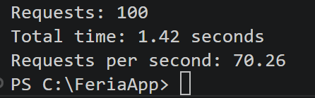

# 08. Deployment.

## Deployment environments.

FeriaApp has two distinct deployment environments:

| Environment | Platform | URL |
|---|---|---|
| Public website | GitHub Pages | https://pablitoclavito04.github.io/FeriaApp/ |
| Administration panel + Backend | Docker (local) | http://localhost |

---

## Public website on GitHub Pages.

### Configuration.

The public website is served from the `gh-pages` branch of the repository. GitHub Pages automatically detects this branch and publishes it at the configured URL.

Configuration found at: **GitHub → Repository → Settings → Pages → Branch: gh-pages → Folder: / (root)**

### Deployment process.

The public website deployment is automatic every time the administrator presses the **"Publish"** button in the administration panel:

1. The backend queries MongoDB and retrieves all updated data.
2. It generates the JSON files (`fairs.json`, `casetas.json`, `menus.json`, `concerts.json`).
3. It uses Octokit to upload the JSON files to the `gh-pages` branch in the `data/` folder.
4. It uploads Caseta images to the `uploads/` folder.
5. GitHub Pages deploys automatically within 2 minutes.

---

## Administration panel with Docker.

### Requirements.

- Docker 28.x or higher.
- Docker Compose 2.x or higher.

### Docker services.

| Service | Image | Internal port | Description |
|---|---|---|---|
| nginx | nginx:alpine | 80 | Reverse proxy |
| backend | feriaapp-backend | 5000 | REST API |
| frontend | feriaapp-frontend | 80 | Administration panel |
| public-web | feriaapp-public | 80 | Public website |
| mongo | mongo:7 | 27017 | Database |

### Deployment process.

```bash
# 1. Clone the repository
git clone https://github.com/pablitoclavito04/FeriaApp.git
cd FeriaApp

# 2. Configure environment variables
cp .env.example .env
# Edit .env with real values

# 3. Start the containers
docker-compose up --build

# 4. Create the administrator user (in another terminal)
docker exec feriaapp-backend node seedAdmin.js
```

### Nginx routing.

| Route | Destination | Description |
|---|---|---|
| / | frontend:80 | Administration panel |
| /api/ | backend:5000 | REST API |
| /public/ | public-web:80 | Public website |

---

## CI/CD Pipeline with GitHub Actions.

The pipeline is located at `.github/workflows/ci.yml` and runs automatically on every push to `develop` or `main`.

### Jobs.

**1. test-backend:**
- Starts a MongoDB instance in the CI environment.
- InCasetas backend dependencies.
- Runs tests with Jest.

**2. build-frontend:**
- InCasetas frontend dependencies.
- Runs `npm run build` to verify it compiles correctly.

**3. docker-build:**
- Only runs if both previous jobs have passed.
- Builds all Docker images to verify the Dockerfiles are valid.

### Pipeline flow.

```
Push to develop or main
        │
        ▼
┌───────────────────┐    ┌───────────────────┐
│   test-backend    │    │  build-frontend   │
│  (with CI MongoDB)│    │  (npm run build)  │
└─────────┬─────────┘    └────────┬──────────┘
          │                       │
          └──────────┬────────────┘
                     │
                     ▼
           ┌──────────────────┐
           │   docker-build   │
           │  (build images)  │
           └──────────────────┘
```

---

## API verification with curl

Once the backend is running, you can verify the endpoints with the following curl commands:

### Authentication
```bash
# Login and get JWT token
curl -X POST http://localhost:5000/api/auth/login \
  -H "Content-Type: application/json" \
  -d '{"email":"admin@feriaapp.com","password":"admin1234"}'
```

### Fairs
```bash
# Get all fairs (public)
curl http://localhost:5000/api/fairs

# Get fairs with pagination
curl http://localhost:5000/api/fairs?page=1&limit=10

# Get only active fairs
curl http://localhost:5000/api/fairs?active=true

# Create a fair (requires token)
curl -X POST http://localhost:5000/api/fairs \
  -H "Content-Type: application/json" \
  -H "Authorization: Bearer YOUR_TOKEN" \
  -d '{"name":"Feria de Jerez 2026","startDate":"2026-05-06","endDate":"2026-05-11","location":"Parque González Hontoria","active":true}'
```

### Casetas
```bash
# Get all Casetas (public)
curl http://localhost:5000/api/casetas

# Get Casetas with pagination
curl http://localhost:5000/api/casetas?page=1&limit=10

# Filter Casetas by fair
curl http://localhost:5000/api/casetas?fair=FAIR_ID

# Filter Casetas by number
curl http://localhost:5000/api/casetas?number=1

# Create a Caseta (requires token)
curl -X POST http://localhost:5000/api/casetas \
  -H "Content-Type: application/json" \
  -H "Authorization: Bearer YOUR_TOKEN" \
  -d '{"name":"La Casapuerta","number":1,"fair":"FAIR_ID"}'
```

### Menus
```bash
# Get all menus (public)
curl http://localhost:5000/api/menus

# Get menus with pagination
curl http://localhost:5000/api/menus?page=1&limit=10

# Filter menus by Caseta
curl http://localhost:5000/api/menus?caseta=CASETA_ID

# Get menus by Caseta (dedicated endpoint)
curl http://localhost:5000/api/menus/caseta/CASETA_ID
```

### Concerts
```bash
# Get all concerts (public)
curl http://localhost:5000/api/concerts

# Get concerts with pagination
curl http://localhost:5000/api/concerts?page=1&limit=10

# Filter concerts by Caseta
curl http://localhost:5000/api/concerts?caseta=CASETA_ID

# Create a concert (requires token)
curl -X POST http://localhost:5000/api/concerts \
  -H "Content-Type: application/json" \
  -H "Authorization: Bearer YOUR_TOKEN" \
  -d '{"artist":"Manuel de los Santos","date":"2026-05-10","time":"22:00","caseta":"CASETA_ID"}'
```

---

## Troubleshooting

### MongoDB does not connect:
**Symptom:** `Error connecting to MongoDB` in the backend terminal.
**Solution:** Make sure MongoDB is running.
```bash
# Windows
net start MongoDB

# Verify it is running
mongosh
```

### Port 5000 already in use:
**Symptom:** `EADDRINUSE: address already in use :::5000`
**Solution:** Find and stop the process using that port.
```bash
netstat -ano | findstr :5000
taskkill /PID  /F
```

### Port 5173 already in use:
**Symptom:** Frontend does not start.
**Solution:**
```bash
netstat -ano | findstr :5173
taskkill /PID  /F
```

### .env file not found:
**Symptom:** `JWT_SECRET is not defined` or similar errors.
**Solution:** Create the `.env` file in `backend/` using `.env.example` as a template.

### Error publishing to GitHub Pages:
**Symptom:** `Error publishing` in the admin panel.
**Solution:** Verify that `GITHUB_TOKEN` in `backend/.env` is valid and has `repo` scope. Regenerate it at GitHub → Settings → Developer settings → Personal access tokens.

### Docker containers do not start:
**Symptom:** `docker-compose up --build` fails.
**Solution:**
```bash
# Check container logs
docker logs feriaapp-backend
docker logs feriaapp-frontend

# Restart containers
docker-compose down
docker-compose up --build
```

### Tests delete real data:
**Symptom:** Data disappears from MongoDB after running tests.
**Solution:** Make sure `MONGODB_TEST_URI` is defined in `backend/.env`. Tests must use `feriaApp_test`, not `feriaApp`.

---

## Load testing

A basic load test was performed on the `GET /api/fairs` endpoint using PowerShell to simulate 100 sequential requests.

**Results:**

| Metric | Value |
|---|---|
| Total requests | 100 |
| Total time | 1.42 seconds |
| Requests per second | 70.26 |



**Conclusion:** The backend handles over 70 requests per second on a local environment, demonstrating adequate performance for the expected load of a fair information platform.