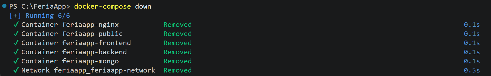
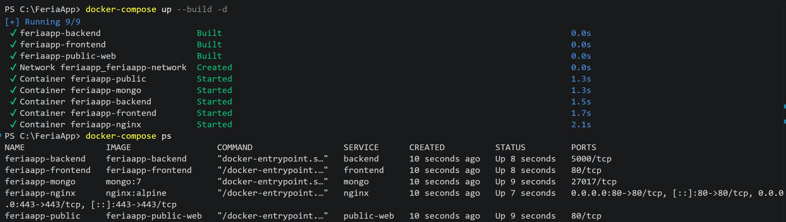
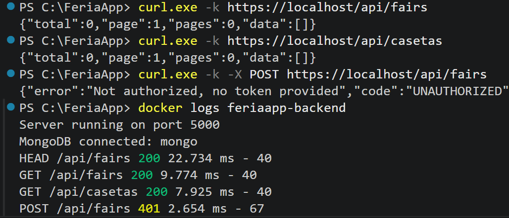
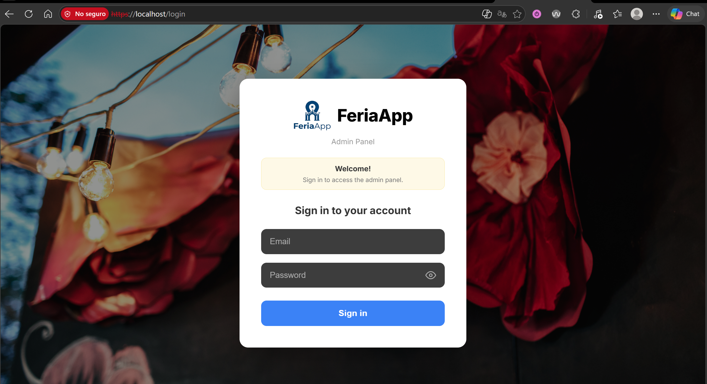
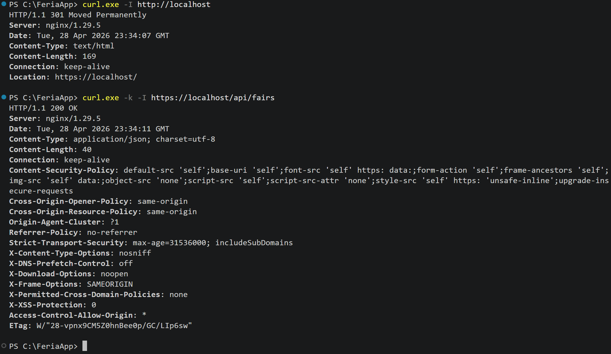
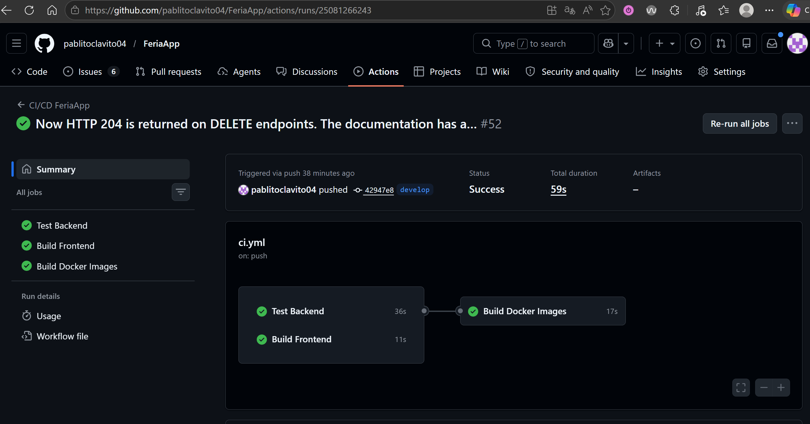

# 08. Deployment.

## Deployment environments.

FeriaApp has two distinct deployment environments:

| Environment | Platform | URL |
|---|---|---|
| Public website | GitHub Pages | https://pablitoclavito04.github.io/FeriaApp/ |
| Administration panel + Backend | Docker (local) | http://localhost |

---

## Public website on GitHub Pages.

### Configuration.

The public website is served from the `gh-pages` branch of the repository. GitHub Pages automatically detects this branch and publishes it at the configured URL.

Configuration found at: **GitHub → Repository → Settings → Pages → Branch: gh-pages → Folder: / (root)**

### Deployment process.

The public website deployment is automatic every time the administrator presses the **"Publish"** button in the administration panel:

1. The backend queries MongoDB and retrieves all updated data.
2. It generates the JSON files (`fairs.json`, `casetas.json`, `menus.json`, `concerts.json`).
3. It uses Octokit to upload the JSON files to the `gh-pages` branch in the `data/` folder.
4. It uploads Caseta images to the `uploads/` folder.
5. GitHub Pages deploys automatically within 2 minutes.

### Run evidence


The screenshot shows the public site live on GitHub Pages — the URL bar confirms the real `pablitoclavito04.github.io/FeriaApp/` domain (HTTPS served by GitHub's CDN, not localhost). The home renders the hero with the FeriaApp branding, the marketing copy, and the "Entrar" button that takes the visitor into the public catalogue (casetas, menús and concerts loaded from the JSON files pushed by the admin panel's *Publish* action). The **Instalar** button in the top-right comes from the PWA manifest, confirming the site is installable as a standalone app.

---

## Administration panel with Docker.

### Requirements.

- Docker 28.x or higher.
- Docker Compose 2.x or higher.

### Docker services.

| Service | Image | Internal port | Description |
|---|---|---|---|
| nginx | nginx:alpine | 80 | Reverse proxy |
| backend | feriaapp-backend | 5000 | REST API |
| frontend | feriaapp-frontend | 80 | Administration panel |
| public-web | feriaapp-public | 80 | Public website |
| mongo | mongo:7 | 27017 | Database |

### Deployment process.

```bash
# 1. Clone the repository
git clone https://github.com/pablitoclavito04/FeriaApp.git
cd FeriaApp

# 2. Configure environment variables
cp .env.example .env
# Edit .env with real values

# 3. Start the containers
docker-compose up --build

# 4. Create the administrator user (in another terminal)
docker exec feriaapp-backend node seedAdmin.js
```

### Run evidence

Bringing the stack down with `docker-compose down` removes all five containers and the internal network:



Starting the stack with `docker-compose up --build -d` and verifying with `docker-compose ps` shows all five services in `Up` state. Only nginx exposes ports to the host (`80` and `443`); the rest stay on the internal network:



Once the stack is up, three sample requests against the HTTPS endpoint (two public GETs and one POST without token) are reflected in the backend logs. The logs also show the boot sequence (`Server running on port 5000`, `MongoDB connected: mongo`):



This single capture exercises the full chain — HTTPS client → nginx reverse proxy → backend → MongoDB — and demonstrates that the auth middleware rejects unauthenticated writes (`401 UNAUTHORIZED`).

### Nginx routing.

| Route | Destination | Description |
|---|---|---|
| / | frontend:80 | Administration panel |
| /api/ | backend:5000 | REST API |
| /public/ | public-web:80 | Public website |

### HTTPS configuration.

The reverse proxy is configured to serve all traffic over HTTPS. Port `80` redirects every request to `443` with a `301` permanent redirect.

For local development, a **self-signed certificate** is used (`nginx/ssl/feriaapp.crt` and `feriaapp.key`). It is generated with OpenSSL:

```bash
mkdir -p nginx/ssl
openssl req -x509 -nodes -days 365 -newkey rsa:2048 \
  -keyout nginx/ssl/feriaapp.key \
  -out nginx/ssl/feriaapp.crt \
  -subj "/C=ES/ST=Cadiz/L=Jerez/O=FeriaApp/OU=TFG/CN=localhost"
```

The certificate files are listed in `.gitignore` and must be regenerated on each clone. They are mounted into the nginx container as a read-only volume.

The browser will display a warning the first time (`NET::ERR_CERT_AUTHORITY_INVALID`) because the certificate is not signed by a trusted authority. Click **Advanced → Continue to localhost** to accept it for the session.



The "No seguro" / "Not secure" indicator next to the URL is expected with a self-signed certificate — the connection is still encrypted with TLS 1.2/1.3.

For verification:
```bash
# HTTP redirect to HTTPS
curl -I http://localhost
# HTTP/1.1 301 Moved Permanently
# Location: https://localhost/

# HTTPS request (use -k to ignore the self-signed warning)
curl -k -I https://localhost/api/fairs
# HTTP/1.1 200 OK
```



The first request confirms the HTTP→HTTPS redirect (`301 Moved Permanently` + `Location: https://localhost/`). The second confirms that nginx serves TLS correctly and proxies the API to the backend (`200 OK`, `Content-Type: application/json`). The response also includes the Helmet security headers — most notably `Strict-Transport-Security: max-age=31536000`, which instructs the browser to always use HTTPS for this host.

**For production deployment** the workflow would use Let's Encrypt instead:
1. Register a public domain pointing to the VPS IP.
2. Install **certbot** in the host: `sudo apt install certbot python3-certbot-nginx`.
3. Run `sudo certbot --nginx -d feriaapp.example.com` — certbot validates domain ownership, issues the certificate and reconfigures nginx automatically.
4. A `cron` job renews the certificate every 60 days.

The current setup is local-only because the project is not deployed on a public server.

---

## CI/CD Pipeline with GitHub Actions.

The pipeline is located at `.github/workflows/ci.yml` and runs automatically on every push to `develop` or `main`.

### Jobs.

**1. test-backend:**
- Starts a MongoDB instance in the CI environment.
- InCasetas backend dependencies.
- Runs tests with Jest.

**2. build-frontend:**
- InCasetas frontend dependencies.
- Runs `npm run build` to verify it compiles correctly.

**3. docker-build:**
- Only runs if both previous jobs have passed.
- Builds all Docker images to verify the Dockerfiles are valid.

### Pipeline flow.

```
Push to develop or main
        │
        ▼
┌───────────────────┐    ┌───────────────────┐
│   test-backend    │    │  build-frontend   │
│  (with CI MongoDB)│    │  (npm run build)  │
└─────────┬─────────┘    └────────┬──────────┘
          │                       │
          └──────────┬────────────┘
                     │
                     ▼
           ┌──────────────────┐
           │   docker-build   │
           │  (build images)  │
           └──────────────────┘
```

### Run evidence



The screenshot shows a successful run on the `develop` branch: `Test Backend` (36s), `Build Frontend` (11s) and `Build Docker Images` (17s) all completed in green. The total duration is 59 seconds.

---

## API verification with curl

### Interactive documentation (Swagger UI)

The OpenAPI 3.0 specification is served at `https://localhost/api/docs` through the same nginx reverse proxy. The UI lists every endpoint grouped by tag (`Auth`, `Casetas`, `Concerts`, `Fairs`, `Menus`, `Publish`) and exposes the **Authorize** button so JWT-protected routes can be exercised directly from the browser.


The screenshot shows the `Fairs` tag expanded, listing all 19 fair-related routes — basic CRUD plus the advanced read-only endpoints (`/active`, `/latest`, `/range`, `/count/status`, `/sorted/enddate`, `/search/{name}`) and the nested resource endpoints (`/{id}/casetas`, `/{id}/menus`, `/{id}/concerts`, `/{id}/stats`, `/{id}/full`). Each operation is colour-coded by HTTP verb and write operations (POST/PUT/DELETE) display a padlock icon indicating they require the `Authorization: Bearer <token>` header.

### curl reference

Once the backend is running, you can verify the endpoints with the following curl commands:

### Authentication
```bash
# Login and get JWT token
curl -X POST http://localhost:5000/api/auth/login \
  -H "Content-Type: application/json" \
  -d '{"email":"admin@feriaapp.com","password":"admin1234"}'
```

### Fairs
```bash
# Get all fairs (public)
curl http://localhost:5000/api/fairs

# Get fairs with pagination
curl http://localhost:5000/api/fairs?page=1&limit=10

# Get only active fairs
curl http://localhost:5000/api/fairs?active=true

# Create a fair (requires token)
curl -X POST http://localhost:5000/api/fairs \
  -H "Content-Type: application/json" \
  -H "Authorization: Bearer YOUR_TOKEN" \
  -d '{"name":"Feria de Jerez 2026","startDate":"2026-05-06","endDate":"2026-05-11","location":"Parque González Hontoria","active":true}'
```

### Casetas
```bash
# Get all Casetas (public)
curl http://localhost:5000/api/casetas

# Get Casetas with pagination
curl http://localhost:5000/api/casetas?page=1&limit=10

# Filter Casetas by fair
curl http://localhost:5000/api/casetas?fair=FAIR_ID

# Filter Casetas by number
curl http://localhost:5000/api/casetas?number=1

# Create a Caseta (requires token)
curl -X POST http://localhost:5000/api/casetas \
  -H "Content-Type: application/json" \
  -H "Authorization: Bearer YOUR_TOKEN" \
  -d '{"name":"La Casapuerta","number":1,"fair":"FAIR_ID"}'
```

### Menus
```bash
# Get all menus (public)
curl http://localhost:5000/api/menus

# Get menus with pagination
curl http://localhost:5000/api/menus?page=1&limit=10

# Filter menus by Caseta
curl http://localhost:5000/api/menus?caseta=CASETA_ID

# Get menus by Caseta (dedicated endpoint)
curl http://localhost:5000/api/menus/caseta/CASETA_ID
```

### Concerts
```bash
# Get all concerts (public)
curl http://localhost:5000/api/concerts

# Get concerts with pagination
curl http://localhost:5000/api/concerts?page=1&limit=10

# Filter concerts by Caseta
curl http://localhost:5000/api/concerts?caseta=CASETA_ID

# Create a concert (requires token)
curl -X POST http://localhost:5000/api/concerts \
  -H "Content-Type: application/json" \
  -H "Authorization: Bearer YOUR_TOKEN" \
  -d '{"artist":"Manuel de los Santos","date":"2026-05-10","time":"22:00","caseta":"CASETA_ID"}'
```

### Advanced endpoints

```bash
# Search fairs by name
curl http://localhost:5000/api/fairs/search/jerez

# Get fair with all its data
curl http://localhost:5000/api/fairs/FAIR_ID/full

# Get stalls with image
curl http://localhost:5000/api/casetas/filter/withimage

# Get stall with its menus and concerts
curl http://localhost:5000/api/casetas/CASETA_ID/full

# Get most expensive menu
curl http://localhost:5000/api/menus/filter/mostexpensive

# Get menus by price range
curl "http://localhost:5000/api/menus/filter/price?min=5&max=10"

# Get upcoming concerts
curl http://localhost:5000/api/concerts/filter/upcoming

# Get concerts by genre
curl http://localhost:5000/api/concerts/filter/genre/flamenco

# Get full statistics with aggregations
curl http://localhost:5000/api/stats
```

### Nested routes for menus and concerts

```bash
# Get the caseta of a menu
curl http://localhost:5000/api/menus/MENU_ID/caseta

# Get similar menus by price
curl http://localhost:5000/api/menus/MENU_ID/similar

# Get concerts of the caseta of a menu
curl http://localhost:5000/api/menus/MENU_ID/caseta/concerts

# Get the caseta of a concert
curl http://localhost:5000/api/concerts/CONCERT_ID/caseta

# Get other concerts on the same day
curl http://localhost:5000/api/concerts/CONCERT_ID/sameday

# Get other concerts of the same genre
curl http://localhost:5000/api/concerts/CONCERT_ID/samegenre

# Get menus of the caseta of a concert
curl http://localhost:5000/api/concerts/CONCERT_ID/caseta/menus
```

---

## Troubleshooting

### MongoDB does not connect:
**Symptom:** `Error connecting to MongoDB` in the backend terminal.
**Solution:** Make sure MongoDB is running.
```bash
# Windows
net start MongoDB

# Verify it is running
mongosh
```

### Port 5000 already in use:
**Symptom:** `EADDRINUSE: address already in use :::5000`
**Solution:** Find and stop the process using that port.
```bash
netstat -ano | findstr :5000
taskkill /PID  /F
```

### Port 5173 already in use:
**Symptom:** Frontend does not start.
**Solution:**
```bash
netstat -ano | findstr :5173
taskkill /PID  /F
```

### .env file not found:
**Symptom:** `JWT_SECRET is not defined` or similar errors.
**Solution:** Create the `.env` file in `backend/` using `.env.example` as a template.

### Error publishing to GitHub Pages:
**Symptom:** `Error publishing` in the admin panel.
**Solution:** Verify that `GITHUB_TOKEN` in `backend/.env` is valid and has `repo` scope. Regenerate it at GitHub → Settings → Developer settings → Personal access tokens.

### Docker containers do not start:
**Symptom:** `docker-compose up --build` fails.
**Solution:**
```bash
# Check container logs
docker logs feriaapp-backend
docker logs feriaapp-frontend

# Restart containers
docker-compose down
docker-compose up --build
```

### Tests delete real data:
**Symptom:** Data disappears from MongoDB after running tests.
**Solution:** Make sure `MONGODB_TEST_URI` is defined in `backend/.env`. Tests must use `feriaApp_test`, not `feriaApp`.

---

## Load testing

Two load tests were performed against the `GET /api/fairs` endpoint to verify the backend performs adequately under load.

### 1. Sequential baseline with PowerShell

A first sanity check sent 100 sequential requests from a PowerShell loop — useful as a quick smoke test, but it only measures the round-trip of one request at a time, with no concurrency.

| Metric | Value |
|---|---|
| Total requests | 100 |
| Total time | 1.42 seconds |
| Requests per second | 70.26 |


### 2. Concurrent load test with autocannon

To exercise the backend under realistic concurrent load, a second test was run with [autocannon](https://github.com/mcollina/autocannon) (10 parallel connections sustained for 20 seconds against the HTTPS endpoint exposed by nginx):

```bash
autocannon -c 10 -d 20 https://localhost/api/fairs
```


**Results:**

| Metric | Value |
|---|---|
| Concurrent connections | 10 |
| Duration | 20 seconds |
| Total requests | ~12 000 |
| Avg requests/second | **606.5** |
| Median latency (p50) | 16 ms |
| 99th-percentile latency | 39 ms |
| Max latency | 80 ms |
| Errors | 0 |
| Throughput | ~574 kB/s |

**Conclusion:** Under 10 concurrent connections the backend sustains over **600 requests per second** with a median latency of **16 ms** and zero errors — roughly an 8.6× improvement over the sequential PowerShell test, which is the expected behaviour for a Node.js + Express stack benefiting from event-loop concurrency. The 99th percentile stays under 40 ms, well within the targets for an interactive fair-information platform; even the worst sample (80 ms) is imperceptible to a user. These numbers leave ample headroom for the realistic load of public-facing fair browsing during a typical fair week.