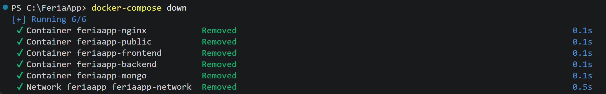
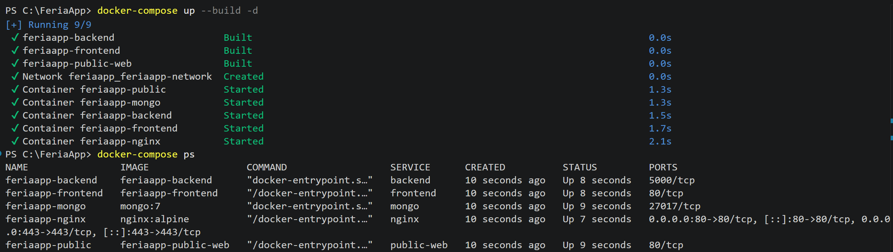
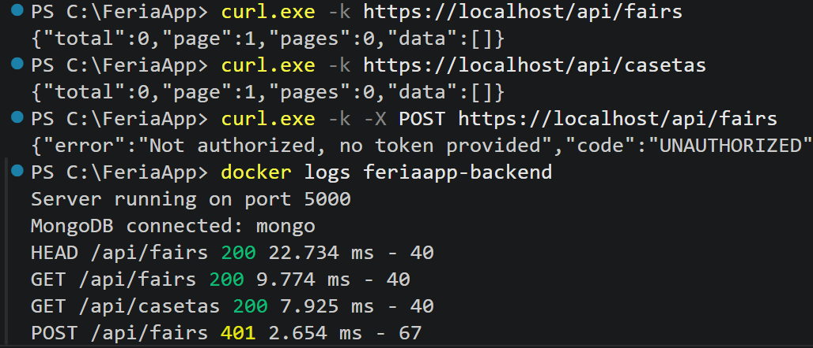
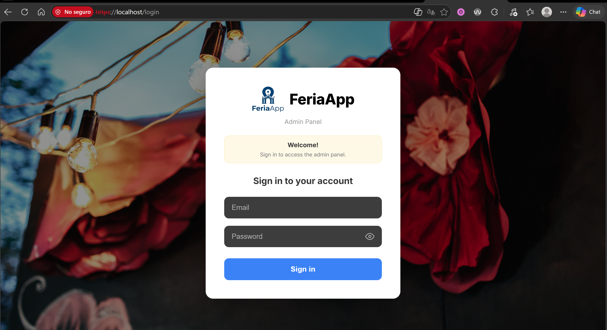
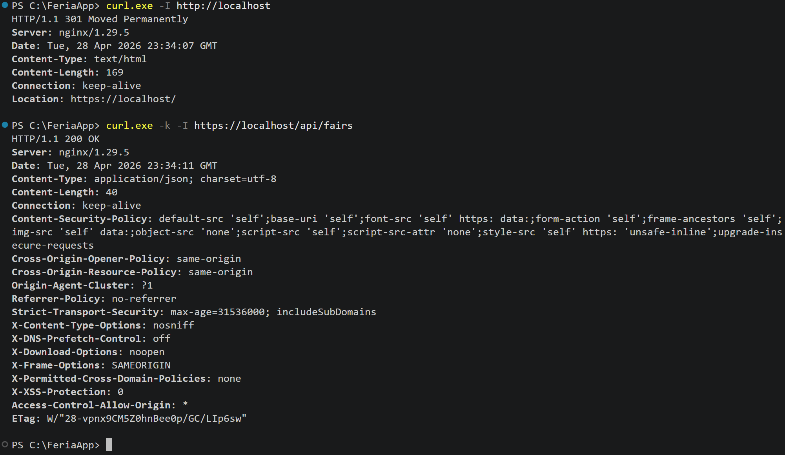
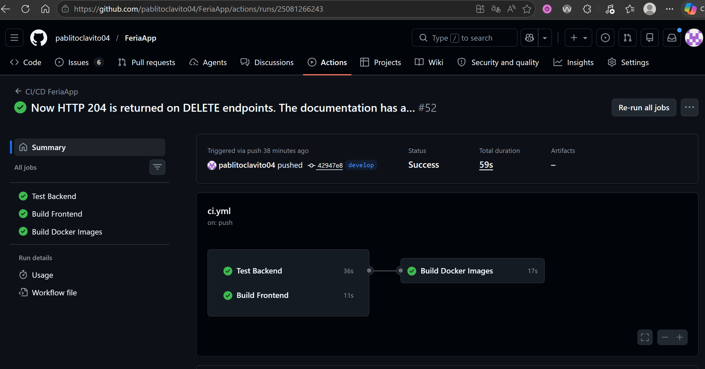
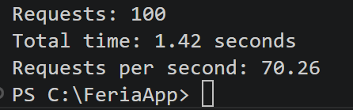

# 08. Deployment.

> **Module evaluation note.** A separate document, [08-despliegue-eval.md](08-despliegue-eval.md), maps this deployment work to the criteria of the *Despliegue de Aplicaciones Web* module rubric (c1, c2, C7, C8). This main document describes the deployment itself; the `-eval` companion explains how each rubric criterion is covered, with cross-references to the relevant sections, files and screenshots.

## Deployment environments.

FeriaApp is deployed across these environments:

| Environment | Platform | URL |
|---|---|---|
| Public website (cloud) | DigitalOcean (Docker + nginx) | https://feriaapp.com |
| Administration panel + Backend (cloud) | DigitalOcean (Docker + nginx) | https://admin.feriaapp.com |
| Public website (mirror) | GitHub Pages | https://pablitoclavito04.github.io/FeriaApp/ |
| Full stack (local development) | Docker (local) | http://localhost |

The public website and the admin panel both run on the **same DigitalOcean server**, split by nginx `server_name` into two subdomains. The GitHub Pages copy is kept as a free public mirror/backup. See [Cloud deployment (DigitalOcean)](#cloud-deployment-digitalocean) below for the full setup.

---

## Public website on GitHub Pages.

> The public website's **primary** deployment is now the cloud server at `feriaapp.com` (see [Cloud deployment](#cloud-deployment-digitalocean)). The GitHub Pages deployment described here remains active as a free public mirror, updated by the same *Publish* action. The site detects its base path at runtime, so the same build works at `/` on the domain and under `/FeriaApp/` on GitHub Pages.

### Configuration.

The public website is served from the `gh-pages` branch of the repository. GitHub Pages automatically detects this branch and publishes it at the configured URL.

Configuration found at: **GitHub → Repository → Settings → Pages → Branch: gh-pages → Folder: / (root)**

### Deployment process.

The public website deployment is automatic every time the administrator presses the **"Publish"** button in the administration panel:

1. The backend queries MongoDB and retrieves all updated data.
2. It generates the JSON files (`fairs.json`, `casetas.json`, `menus.json`, `concerts.json`).
3. It uses Octokit to upload the JSON files to the `gh-pages` branch in the `data/` folder.
4. It uploads Caseta images to the `uploads/` folder.
5. GitHub Pages deploys automatically within 2 minutes.
6. The same JSON files are also written to a local `uploads/public-data` folder on the server, which nginx serves at `feriaapp.com/data`. This lets the cloud public site (`feriaapp.com`) show the published data directly from our own server, in addition to the GitHub Pages mirror.

### Run evidence


The screenshot shows the public site live on GitHub Pages — the URL bar confirms the real `pablitoclavito04.github.io/FeriaApp/` domain (HTTPS served by GitHub's CDN, not localhost). The home renders the hero with the FeriaApp branding, the marketing copy, and the "Entrar" button that takes the visitor into the public catalogue (casetas, menús and concerts loaded from the JSON files pushed by the admin panel's *Publish* action). The **Instalar** button in the top-right comes from the PWA manifest, confirming the site is installable as a standalone app.

---

## Administration panel with Docker.

### Requirements.

- Docker 28.x or higher.
- Docker Compose 2.x or higher.

### Architecture diagram.

The administration stack is composed of five containerised services. Only the reverse proxy (`nginx`) is reachable from the host; every other service is reachable only through the internal Docker network `feriaapp_feriaapp-network` (bridge driver, subnet `172.23.0.0/16`).

```
                       ┌─────────────────────┐
                       │   Browser / curl    │
                       └──────────┬──────────┘
                                  │ HTTPS (443) / HTTP (80 → 301 → 443)
                                  ▼
                  ┌────────────────────────────────┐
                  │            nginx               │
                  │  reverse proxy + TLS (Helmet)  │
                  └───┬───────────┬───────────┬────┘
                      │           │           │
              /api/   │      /    │   /public/│
                      ▼           ▼           ▼
                ┌──────────┐ ┌──────────┐ ┌──────────┐
                │ backend  │ │ frontend │ │public-web│
                │ Node:5000│ │nginx:80  │ │nginx:80  │
                └────┬─────┘ └──────────┘ └──────────┘
                     │
                     │ mongodb://mongo:27017
                     ▼
                ┌──────────┐
                │  mongo   │
                │  :27017  │  ─── volume: mongo-data → /data/db
                └──────────┘
                     ▲
                     │
                     └─── volume: backend-uploads → /app/uploads (used by backend)

       Docker network: feriaapp_feriaapp-network (bridge, 172.23.0.0/16)
       Host-exposed ports: 80, 443 (nginx only)
```

The diagram above shows the **path-based** routing used for local/direct-IP access (the nginx `default_server`). In the **cloud** deployment the same containers are reached through two subdomains instead: nginx routes by `server_name` so `feriaapp.com` lands on `public-web` (with `/data` and `/uploads` proxied to the backend) and `admin.feriaapp.com` lands on `frontend` (with `/api` and `/uploads`). See [Cloud deployment](#cloud-deployment-digitalocean).

### Docker services.

| Service | Image | Internal port | Description |
|---|---|---|---|
| nginx | nginx:alpine | 80 | Reverse proxy |
| backend | feriaapp-backend | 5000 | REST API |
| frontend | feriaapp-frontend | 80 | Administration panel |
| public-web | feriaapp-public | 80 | Public website |
| mongo | mongo:7 | 27017 | Database |

Two named Docker volumes are declared in the compose file: `mongo-data` (persists MongoDB data at `/data/db`) and `backend-uploads` (persists admin-uploaded caseta images at `/app/uploads`). Both survive `docker-compose down` and are only removed with `docker-compose down -v`.

### Deployment process.

> ⚠️ **Step 2 is mandatory.** Skipping it makes Docker Compose start with empty values for `JWT_SECRET`, `GITHUB_TOKEN`, `GITHUB_OWNER` and `GITHUB_REPO`, which causes warning lines on startup and breaks two real features: **admin login** (the backend cannot sign/verify JWTs with an empty secret) and the **Publish** button (Octokit cannot authenticate against the GitHub API). The `.env` file is gitignored — every fresh clone needs to recreate it.

```bash
# 1. Clone the repository
git clone https://github.com/pablitoclavito04/FeriaApp.git
cd FeriaApp

# 2. Configure environment variables (MANDATORY — see warning above)
cp .env.example .env
# Edit .env with real values:
#   JWT_SECRET     — any non-empty string (used to sign session tokens)
#   GITHUB_TOKEN   — a GitHub PAT with "repo" scope (only needed if you plan to test the "Publish" button)
#   GITHUB_OWNER   — owner of the target repo (e.g. your GitHub username)
#   GITHUB_REPO    — name of the target repo (e.g. FeriaApp)
#   MONGODB_URI    — leave as the default mongodb://mongo:27017/feriaApp for Docker

# 3. Start the containers
docker-compose up --build

# 4. Create the administrator user (in another terminal)
docker exec feriaapp-backend node seedAdmin.js
```

### Run evidence

Bringing the stack down with `docker-compose down` removes all five containers and the internal network:



Starting the stack with `docker-compose up --build -d` and verifying with `docker-compose ps` shows all five services in `Up` state. Only nginx exposes ports to the host (`80` and `443`); the rest stay on the internal network:



Once the stack is up, three sample requests against the HTTPS endpoint (two public GETs and one POST without token) are reflected in the backend logs. The logs also show the boot sequence (`Server running on port 5000`, `MongoDB connected: mongo`):



This single capture exercises the full chain — HTTPS client → nginx reverse proxy → backend → MongoDB — and demonstrates that the auth middleware rejects unauthenticated writes (`401 UNAUTHORIZED`).

### Nginx routing.

Local / direct-IP access (nginx `default_server`, path-based):

| Route | Destination | Description |
|---|---|---|
| / | frontend:80 | Administration panel |
| /api/ | backend:5000 | REST API |
| /public/ | public-web:80 | Public website |

Cloud access (routed by `server_name` into two subdomains):

| Host | Route | Destination | Description |
|---|---|---|---|
| admin.feriaapp.com | / | frontend:80 | Administration panel |
| admin.feriaapp.com | /api/ · /uploads/ | backend:5000 | REST API · uploaded images |
| feriaapp.com | / | public-web:80 | Public website |
| feriaapp.com | /data/ · /uploads/ | backend:5000 | Published JSON data · images |

### HTTPS configuration.

The reverse proxy is configured to serve all traffic over HTTPS. Port `80` redirects every request to `443` with a `301` permanent redirect.

For local development, a **self-signed certificate** is used (`nginx/ssl/feriaapp.crt` and `feriaapp.key`). It is generated with OpenSSL:

```bash
mkdir -p nginx/ssl
openssl req -x509 -nodes -days 365 -newkey rsa:2048 \
  -keyout nginx/ssl/feriaapp.key \
  -out nginx/ssl/feriaapp.crt \
  -subj "/C=ES/ST=Cadiz/L=Jerez/O=FeriaApp/OU=TFG/CN=localhost"
```

The certificate files are listed in `.gitignore` and must be regenerated on each clone. They are mounted into the nginx container as a read-only volume.

The browser will display a warning the first time (`NET::ERR_CERT_AUTHORITY_INVALID`) because the certificate is not signed by a trusted authority. Click **Advanced → Continue to localhost** to accept it for the session.



The "No seguro" / "Not secure" indicator next to the URL is expected with a self-signed certificate — the connection is still encrypted with TLS 1.2/1.3.

For verification:
```bash
# HTTP redirect to HTTPS
curl -I http://localhost
# HTTP/1.1 301 Moved Permanently
# Location: https://localhost/

# HTTPS request (use -k to ignore the self-signed warning)
curl -k -I https://localhost/api/fairs
# HTTP/1.1 200 OK
```



The first request confirms the HTTP→HTTPS redirect (`301 Moved Permanently` + `Location: https://localhost/`). The second confirms that nginx serves TLS correctly and proxies the API to the backend (`200 OK`, `Content-Type: application/json`). The response also includes the Helmet security headers — most notably `Strict-Transport-Security: max-age=31536000`, which instructs the browser to always use HTTPS for this host.

**For a domain-based production deployment** the workflow would use Let's Encrypt instead of a self-signed certificate:
1. Register a public domain pointing to the server IP.
2. Install **certbot** in the host: `sudo apt install certbot python3-certbot-nginx`.
3. Run `sudo certbot --nginx -d feriaapp.example.com` — certbot validates domain ownership, issues the certificate and reconfigures nginx automatically.
4. A `cron` job renews the certificate every 60 days.

The application is also deployed on a public cloud server (see the next section) under the domain **feriaapp.com**, where it does use a trusted Let's Encrypt certificate (no browser warning).

---

## Cloud deployment (DigitalOcean).

The application is deployed on a public cloud server so it can be reached from anywhere — for example by the evaluators, without access to the developer's machine. The same Docker Compose stack used locally runs unchanged on the server, which is the main benefit of containerising the application: *build once, run anywhere*.

### Server (Droplet).

| Item | Value |
|---|---|
| Provider | DigitalOcean (Droplet) |
| Region | Frankfurt (FRA1) — low latency from Spain |
| Image | Docker on Ubuntu 22.04 (Marketplace, Docker pre-installed) |
| Size | Basic, 2 vCPU / 2 GB RAM / 60 GB SSD |
| Domain | feriaapp.com (registered at name.com, DNS managed by DigitalOcean) |
| Access URLs | `https://feriaapp.com` (public site) · `https://admin.feriaapp.com` (admin panel) |
| TLS certificate | Let's Encrypt (trusted, auto-renewing, covers both names) |
| Authentication | SSH key (password login disabled) |

### Deployment process.

The server is provisioned once and then runs the same stack as local development:

```bash
# 1. Connect via SSH (key-based authentication)
ssh -i ~/.ssh/feriaapp_do root@<server-ip>

# 2. Update the base system (security patches)
apt-get update && apt-get upgrade -y

# 3. Clone the repository (production branch)
git clone --branch main https://github.com/pablitoclavito04/FeriaApp.git
cd FeriaApp

# 4. Create the .env with the production secrets (never committed)
#    JWT_SECRET, GITHUB_TOKEN/OWNER/REPO, ANTHROPIC_API_KEY

# 5. Build and start the whole stack
docker compose up --build -d

# 6. Seed the initial users
docker exec feriaapp-backend node seedAdmin.js
```

### Domain, subdomains and trusted HTTPS (Let's Encrypt).

The domain **feriaapp.com** was registered (at name.com) and its DNS delegated to DigitalOcean: the registrar's nameservers were changed to `ns1/ns2/ns3.digitalocean.com`. Two **A records** were created in DigitalOcean's DNS, both pointing at the Droplet's IP:

| Record | Hostname | Points to | Serves |
|---|---|---|---|
| A | `@` (feriaapp.com) | server IP | Public website |
| A | `admin` (admin.feriaapp.com) | server IP | Administration panel |

The two sites are split inside **nginx** by `server_name`: the `feriaapp.com` server block serves the public PWA (with its JSON data at `/data` and images at `/uploads`, both proxied to the backend), and the `admin.feriaapp.com` block serves the React panel plus `/api` and `/uploads`. A `default_server` block keeps direct IP/localhost access working.

A trusted certificate covering **both** names is issued with **certbot** (Let's Encrypt). Because nginx holds port 80, it is briefly stopped while certbot validates in standalone mode:

```bash
apt-get install -y certbot
docker compose stop nginx
certbot certonly --standalone --non-interactive --agree-tos --expand \
  --email <you@example.com> -d feriaapp.com -d admin.feriaapp.com
docker compose up -d
```

The host's `/etc/letsencrypt` is mounted read-only into the nginx container (see `docker-compose.yaml`), and `nginx.conf` points `ssl_certificate`/`ssl_certificate_key` at `/etc/letsencrypt/live/feriaapp.com/` (a single certificate with both names as Subject Alternative Names). Certbot installs a scheduled task that renews the certificate automatically before it expires.

After this the public site is available at **`https://feriaapp.com`** and the panel at **`https://admin.feriaapp.com`**, both with a trusted certificate — no browser warning.

> **Serving the public site from our own server.** The "Publish" action in the panel writes the four JSON files (fairs, casetas, menus, concerts) both to GitHub Pages *and* to a local `uploads/public-data` folder inside the backend volume. nginx serves that folder at `feriaapp.com/data`, so the public site runs fully on our own server without depending on GitHub Pages. The public web derives its base path at runtime, so the same build works at `/` on the domain and under `/FeriaApp/` on GitHub Pages.

### Firewall (UFW).

The host firewall is configured to expose only the strictly necessary ports, so the database and other internal services are never reachable from the internet:

```bash
ufw default deny incoming
ufw default allow outgoing
ufw allow 22/tcp     # SSH (administration)
ufw allow 80/tcp     # HTTP (redirects to HTTPS)
ufw allow 443/tcp    # HTTPS (the application)
ufw enable
```

MongoDB (27017) and the backend (5000) are **not** exposed publicly — they are only reachable inside the Docker network, behind nginx.

### Data migration.

The development data (1 fair, 175 stalls and their images) was migrated from the local MongoDB to the server using `mongodump`/`mongorestore` over an SSH-encrypted channel, and the referenced images under `uploads/` were copied into the backend container. Only the content collections were migrated; users are created on the server with `seedAdmin.js`.

### Updating the deployed application.

When new changes are merged into `main`, the server is updated by pulling and rebuilding only the affected services:

```bash
cd /root/FeriaApp
git pull origin main
docker compose up --build -d        # or: ... --build frontend / backend
```

### Cost and lifecycle.

The Droplet bills per hour (~18 USD/month while it exists). Stopping the Droplet still bills for the reserved resources; to stop billing entirely the Droplet must be **destroyed** from the DigitalOcean control panel once it is no longer needed.

---

## CI/CD Pipeline with GitHub Actions.

The pipeline is located at `.github/workflows/ci.yml` and runs automatically on every push to `develop` or `main`.

### Jobs.

**1. test-backend:**
- Starts a MongoDB instance in the CI environment.
- Installs backend dependencies.
- Runs tests with Jest.

**2. build-frontend:**
- Installs frontend dependencies.
- Runs `npm run build` to verify it compiles correctly.

**3. docker-build:**
- Only runs if both previous jobs have passed.
- Builds all Docker images to verify the Dockerfiles are valid.

**4. publish-images (CD):**
- Runs only on a push to `main` (not on `develop` or pull requests), and only after `docker-build` succeeds.
- Logs in to the **GitHub Container Registry** (`ghcr.io`) using the built-in `GITHUB_TOKEN` (no extra secret needed) with `packages: write` permission.
- Builds and pushes the three service images — `feriaapp-backend`, `feriaapp-frontend`, `feriaapp-public-web` — each tagged with the commit SHA and `latest`. This is the **continuous-deployment artifact**: versioned container images published on every release to `main`.

### Secrets management.

The pipeline does **not** keep any sensitive value inside the YAML. Instead, the `test-backend` job pulls four values from **GitHub Secrets** (Repository → Settings → Secrets and variables → Actions) and injects them into the test environment:

| Secret in GitHub | Injected as `env` | Used by |
|---|---|---|
| `JWT_SECRET` | `JWT_SECRET` | Backend test suite — signs/verifies tokens during integration tests |
| `GH_TOKEN` | `GITHUB_TOKEN` | Octokit publish flow tested against the real GitHub API |
| `GH_OWNER` | `GITHUB_OWNER` | Same as above — owner of the target repo |
| `GH_REPO` | `GITHUB_REPO` | Same as above — name of the target repo |

The relevant block in [.github/workflows/ci.yml](../.github/workflows/ci.yml) is:

```yaml
- name: Run backend tests
  env:
    MONGODB_URI: mongodb://localhost:27017/feriaApp_test
    JWT_SECRET: ${{ secrets.JWT_SECRET }}
    GITHUB_TOKEN: ${{ secrets.GH_TOKEN }}
    GITHUB_OWNER: ${{ secrets.GH_OWNER }}
    GITHUB_REPO: ${{ secrets.GH_REPO }}
  run: |
    cd backend
    npm test
```

`MONGODB_URI` is **not** a secret — it points to the throwaway `mongo:7` service container that the workflow itself starts on `localhost:27017`, so it is intentionally hard-coded.

### Continuous deployment — published container images.

On every push to `main`, the `publish-images` job publishes the three service images to the GitHub Container Registry. These tagged images are the **CD artifact**: a deployment can be reproduced anywhere by pulling them instead of rebuilding from source. They appear under the repository's **Packages** section:

- `ghcr.io/pablitoclavito04/feriaapp-backend:latest`
- `ghcr.io/pablitoclavito04/feriaapp-frontend:latest`
- `ghcr.io/pablitoclavito04/feriaapp-public-web:latest`

(each also tagged with the exact commit SHA for traceability).

> **Not to be confused with the app's "Publish" button.** The panel's *Publish* action is an **application feature**, not part of CI/CD: a user clicks it, and the backend regenerates the public **data** (the four JSON files + images) and pushes it to the `gh-pages` branch via Octokit (re-published by GitHub Pages within ~2 minutes) and to the local `public-data` mirror. That moves *data*; the CD pipeline above moves *code/images*. They are independent.

### Pipeline flow.

```
Push to develop or main
        │
        ▼
┌───────────────────┐    ┌───────────────────┐
│   test-backend    │    │  build-frontend   │
│  (with CI MongoDB)│    │  (npm run build)  │
└─────────┬─────────┘    └────────┬──────────┘
          │                       │
          └──────────┬────────────┘
                     │
                     ▼
           ┌──────────────────┐
           │   docker-build   │   ── CI ──
           │  (build images)  │
           └────────┬─────────┘
                    │  (only if push to main)
                    ▼
           ┌──────────────────────┐
           │   publish-images     │   ── CD ──
           │  push to ghcr.io     │
           │  (SHA + latest tags) │
           └──────────────────────┘
```

### Run evidence



The screenshot shows a successful run on the `develop` branch: `Test Backend` (36s), `Build Frontend` (11s) and `Build Docker Images` (17s) all completed in green. On a push to `main`, a fourth job — `Publish Docker Images (CD)` — runs after these and pushes the tagged images to `ghcr.io`; the published packages are visible under the repository's **Packages** section.

---

## API verification with curl

### Interactive documentation (Swagger UI)

The OpenAPI 3.0 specification is served at `https://localhost/api/docs` through the same nginx reverse proxy. The UI lists every endpoint grouped by tag (`Auth`, `Casetas`, `Concerts`, `Fairs`, `Menus`, `Publish`) and exposes the **Authorize** button so JWT-protected routes can be exercised directly from the browser.


The screenshot shows the `Fairs` tag expanded, listing all 19 fair-related routes — basic CRUD plus the advanced read-only endpoints (`/active`, `/latest`, `/range`, `/count/status`, `/sorted/enddate`, `/search/{name}`) and the nested resource endpoints (`/{id}/casetas`, `/{id}/menus`, `/{id}/concerts`, `/{id}/stats`, `/{id}/full`). Each operation is colour-coded by HTTP verb and write operations (POST/PUT/DELETE) display a padlock icon indicating they require the `Authorization: Bearer <token>` header.

The full OpenAPI 3.0 specification is also exported as a static file in [`docs/api/openapi.json`](api/openapi.json) — see the API design section in `05-diseno.md` for details.

### curl reference

Once the backend is running, you can verify the endpoints with the following curl commands:

### Authentication
```bash
# Login and get JWT token
curl -X POST http://localhost:5000/api/auth/login \
  -H "Content-Type: application/json" \
  -d '{"email":"admin@feriaapp.com","password":"<your-password>"}'
```

### Fairs
```bash
# Get all fairs (public)
curl http://localhost:5000/api/fairs

# Get fairs with pagination
curl http://localhost:5000/api/fairs?page=1&limit=10

# Get only active fairs
curl http://localhost:5000/api/fairs?active=true

# Create a fair (requires token)
curl -X POST http://localhost:5000/api/fairs \
  -H "Content-Type: application/json" \
  -H "Authorization: Bearer YOUR_TOKEN" \
  -d '{"name":"Feria de Jerez 2026","startDate":"2026-05-06","endDate":"2026-05-11","location":"Parque González Hontoria","active":true}'
```

### Casetas
```bash
# Get all Casetas (public)
curl http://localhost:5000/api/casetas

# Get Casetas with pagination
curl http://localhost:5000/api/casetas?page=1&limit=10

# Filter Casetas by fair
curl http://localhost:5000/api/casetas?fair=FAIR_ID

# Filter Casetas by number
curl http://localhost:5000/api/casetas?number=1

# Create a Caseta (requires token)
curl -X POST http://localhost:5000/api/casetas \
  -H "Content-Type: application/json" \
  -H "Authorization: Bearer YOUR_TOKEN" \
  -d '{"name":"La Casapuerta","number":1,"fair":"FAIR_ID"}'
```

### Menus
```bash
# Get all menus (public)
curl http://localhost:5000/api/menus

# Get menus with pagination
curl http://localhost:5000/api/menus?page=1&limit=10

# Filter menus by Caseta
curl http://localhost:5000/api/menus?caseta=CASETA_ID

# Get menus by Caseta (dedicated endpoint)
curl http://localhost:5000/api/menus/caseta/CASETA_ID
```

### Concerts
```bash
# Get all concerts (public)
curl http://localhost:5000/api/concerts

# Get concerts with pagination
curl http://localhost:5000/api/concerts?page=1&limit=10

# Filter concerts by Caseta
curl http://localhost:5000/api/concerts?caseta=CASETA_ID

# Create a concert (requires token)
curl -X POST http://localhost:5000/api/concerts \
  -H "Content-Type: application/json" \
  -H "Authorization: Bearer YOUR_TOKEN" \
  -d '{"artist":"Manuel de los Santos","date":"2026-05-10","time":"22:00","caseta":"CASETA_ID"}'
```

### Advanced endpoints

```bash
# Search fairs by name
curl http://localhost:5000/api/fairs/search/jerez

# Get fair with all its data
curl http://localhost:5000/api/fairs/FAIR_ID/full

# Get stalls with image
curl http://localhost:5000/api/casetas/filter/withimage

# Get stall with its menus and concerts
curl http://localhost:5000/api/casetas/CASETA_ID/full

# Get most expensive menu
curl http://localhost:5000/api/menus/filter/mostexpensive

# Get menus by price range
curl "http://localhost:5000/api/menus/filter/price?min=5&max=10"

# Get upcoming concerts
curl http://localhost:5000/api/concerts/filter/upcoming

# Get concerts by genre
curl http://localhost:5000/api/concerts/filter/genre/flamenco

# Get full statistics with aggregations
curl http://localhost:5000/api/stats
```

### Nested routes for menus and concerts

```bash
# Get the caseta of a menu
curl http://localhost:5000/api/menus/MENU_ID/caseta

# Get similar menus by price
curl http://localhost:5000/api/menus/MENU_ID/similar

# Get concerts of the caseta of a menu
curl http://localhost:5000/api/menus/MENU_ID/caseta/concerts

# Get the caseta of a concert
curl http://localhost:5000/api/concerts/CONCERT_ID/caseta

# Get other concerts on the same day
curl http://localhost:5000/api/concerts/CONCERT_ID/sameday

# Get other concerts of the same genre
curl http://localhost:5000/api/concerts/CONCERT_ID/samegenre

# Get menus of the caseta of a concert
curl http://localhost:5000/api/concerts/CONCERT_ID/caseta/menus
```

---

## Troubleshooting

### MongoDB does not connect:
**Symptom:** `Error connecting to MongoDB` in the backend terminal.
**Solution:** Make sure MongoDB is running.
```bash
# Windows
net start MongoDB

# Verify it is running
mongosh
```

### Port 5000 already in use:
**Symptom:** `EADDRINUSE: address already in use :::5000`
**Solution:** Find and stop the process using that port.
```bash
netstat -ano | findstr :5000
taskkill /PID  /F
```

### Port 5173 already in use:
**Symptom:** Frontend does not start.
**Solution:**
```bash
netstat -ano | findstr :5173
taskkill /PID  /F
```

### .env file not found:
**Symptom:** `JWT_SECRET is not defined` or similar errors.
**Solution:** Create the `.env` file in `backend/` using `.env.example` as a template.

### Error publishing to GitHub Pages:
**Symptom:** `Error publishing` in the admin panel.
**Solution:** Verify that `GITHUB_TOKEN` in `backend/.env` is valid and has `repo` scope. Regenerate it at GitHub → Settings → Developer settings → Personal access tokens.

### Docker containers do not start:
**Symptom:** `docker-compose up --build` fails.
**Solution:**
```bash
# Check container logs
docker logs feriaapp-backend
docker logs feriaapp-frontend

# Restart containers
docker-compose down
docker-compose up --build
```

### Tests delete real data:
**Symptom:** Data disappears from MongoDB after running tests.
**Solution:** Make sure `MONGODB_TEST_URI` is defined in `backend/.env`. Tests must use `feriaApp_test`, not `feriaApp`.

---

## Load testing

Two load tests were performed against the `GET /api/fairs` endpoint to verify the backend performs adequately under load.

### 1. Sequential baseline with PowerShell

A first sanity check sent 100 sequential requests from a PowerShell loop — useful as a quick smoke test, but it only measures the round-trip of one request at a time, with no concurrency.

| Metric | Value |
|---|---|
| Total requests | 100 |
| Total time | 1.42 seconds |
| Requests per second | 70.26 |



### 2. Concurrent load test with autocannon

To exercise the backend under realistic concurrent load, a second test was run with [autocannon](https://github.com/mcollina/autocannon) (10 parallel connections sustained for 20 seconds against the HTTPS endpoint exposed by nginx):

```bash
autocannon -c 10 -d 20 https://localhost/api/fairs
```


**Results:**

| Metric | Value |
|---|---|
| Concurrent connections | 10 |
| Duration | 20 seconds |
| Total requests | ~12 000 |
| Avg requests/second | **606.5** |
| Median latency (p50) | 16 ms |
| 99th-percentile latency | 39 ms |
| Max latency | 80 ms |
| Errors | 0 |
| Throughput | ~574 kB/s |

**Conclusion:** Under 10 concurrent connections the backend sustains over **600 requests per second** with a median latency of **16 ms** and zero errors — roughly an 8.6× improvement over the sequential PowerShell test, which is the expected behaviour for a Node.js + Express stack benefiting from event-loop concurrency. The 99th percentile stays under 40 ms, well within the targets for an interactive fair-information platform; even the worst sample (80 ms) is imperceptible to a user. These numbers leave ample headroom for the realistic load of public-facing fair browsing during a typical fair week.